# AI-Native Beam Selection for 6G Networks
### Zero-Shot Cross-City Generalization via Residual MLP on DeepMIMO/Sionna Datasets

> A lightweight deep learning system that predicts optimal beams in 6G mmWave networks directly from GPS coordinates — trained once in New York, deployed everywhere.

---

## Overview

Initial access beam selection is a critical bottleneck in 5G/6G mmWave deployments. Traditional exhaustive beam sweeping introduces latency and overhead incompatible with next-generation RAN requirements. This project implements a production-grade residual MLP that maps normalized 2D UE GPS coordinates to discrete beam indices of an **8×8 UPA antenna codebook** (64 beams), eliminating sweep overhead entirely.

The key research question: *Can a model trained on one city's spatial–beam mapping generalize to an entirely different city without retraining?*

The answer from 20+ experiments across 6 US cities: **yes — with <1.3% average accuracy degradation.**

---

## Architecture

```
Input: [x_norm, y_norm]  →  2D normalized GPS coordinates
         ↓
  Linear(2 → 256) + BatchNorm + ReLU + Dropout(0.3)
         ↓
  ResBlock × 3: Linear(256→256) + BN + ReLU + skip connection
         ↓
  Linear(256 → 64)  →  Softmax over 64 beam indices
         ↓
Output: beam_index ∈ {0, ..., 63}
```

**Model size:** ~18,000 parameters | **Inference:** sub-millisecond on CPU | **Format:** PyTorch `.pt`

---

## Dataset

Spatial–beam mappings were generated using **DeepMIMO** with **NVIDIA Sionna** ray-tracing across six US urban environments, each representing distinct propagation geometry:

| City | Dataset Size | Native Accuracy | Final Loss | Status |
|------|-------------|----------------|------------|--------|
| New York | ~31 MB | 98.46% | 0.3387 | Good |
| Los Angeles | ~32 MB | 98.57% | 0.4205 | Excellent |
| Chicago | ~14 MB | 98.39% | 0.3610 | Good |
| Houston | ~44 MB | **98.99%** | 0.3637 | Excellent |
| Phoenix | ~36 MB | 97.47% | 0.4130 | Pass |
| Santa Clara | ~54 MB | 97.10% | 0.4336 | Pass |

All models trained for **10 epochs** with BCE loss (BCEWithLogitsLoss), Adam optimizer, consistent hyperparameters across all cities.

---

## Results

### Native Performance — All 6 Cities

Each city model trained and evaluated on its own held-out test split.

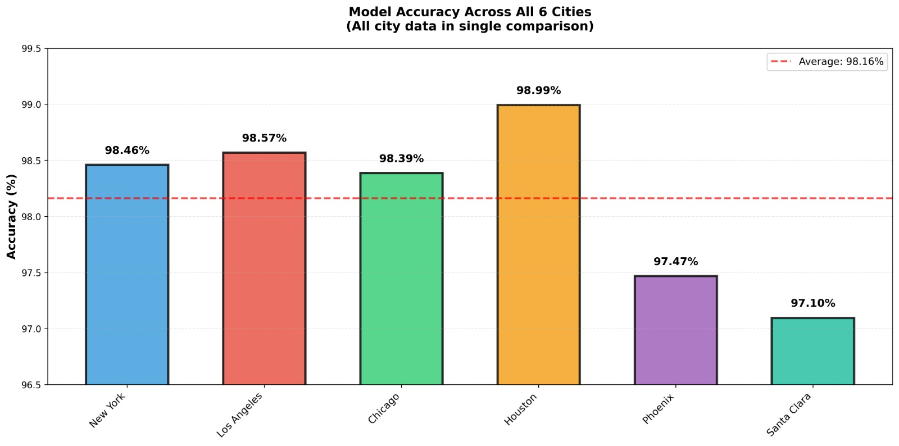

Mean native accuracy: **98.16%** across all cities. Houston achieves the best result at **98.99%**, benefiting from the largest dataset (~44 MB). Chicago achieves strong accuracy (98.39%) despite having the smallest dataset (~14 MB), suggesting a simpler geometric propagation structure.

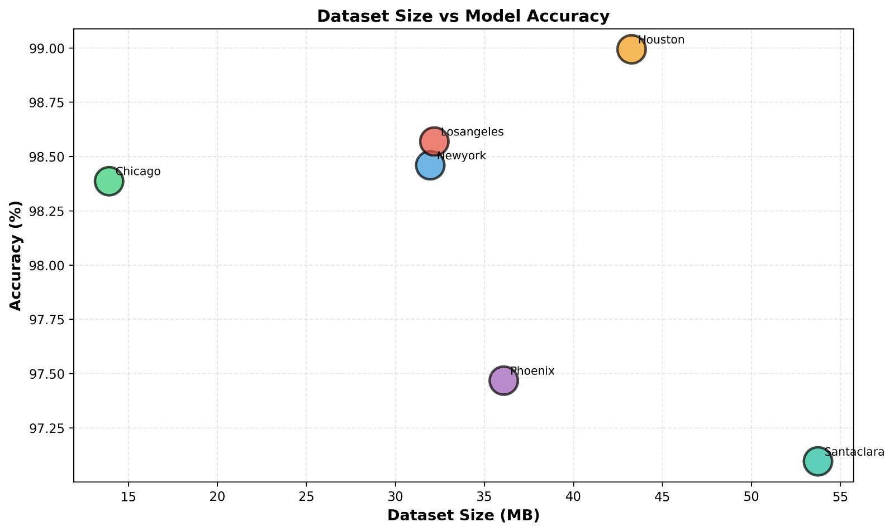

Dataset size does not linearly predict accuracy — Chicago's compact dataset outperforms Phoenix's larger one, pointing to environment-specific propagation complexity as the dominant factor.

---

### Training Convergence

All six models converge cleanly over 10 epochs with negligible train–validation gap, confirming that the residual MLP generalises well and does not overfit city-specific noise.

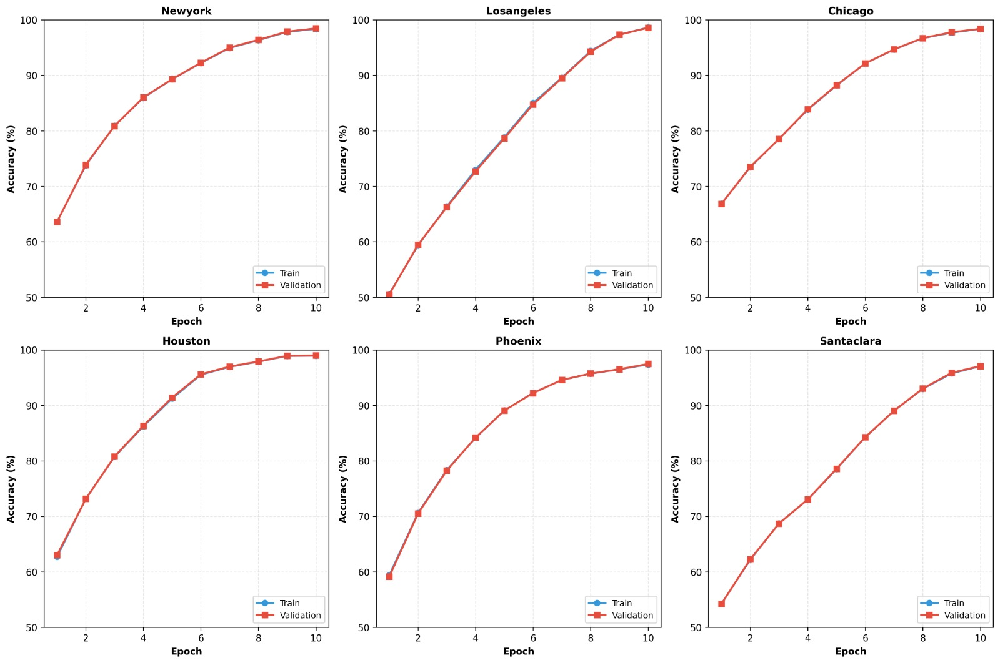

Houston shows the fastest early convergence, while Santa Clara and Los Angeles require more epochs to stabilise. The near-zero train–validation gap across all cities validates the dropout and batch normalisation strategy.

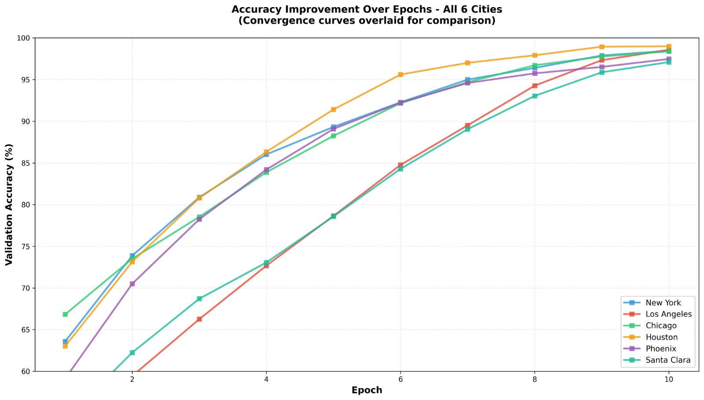
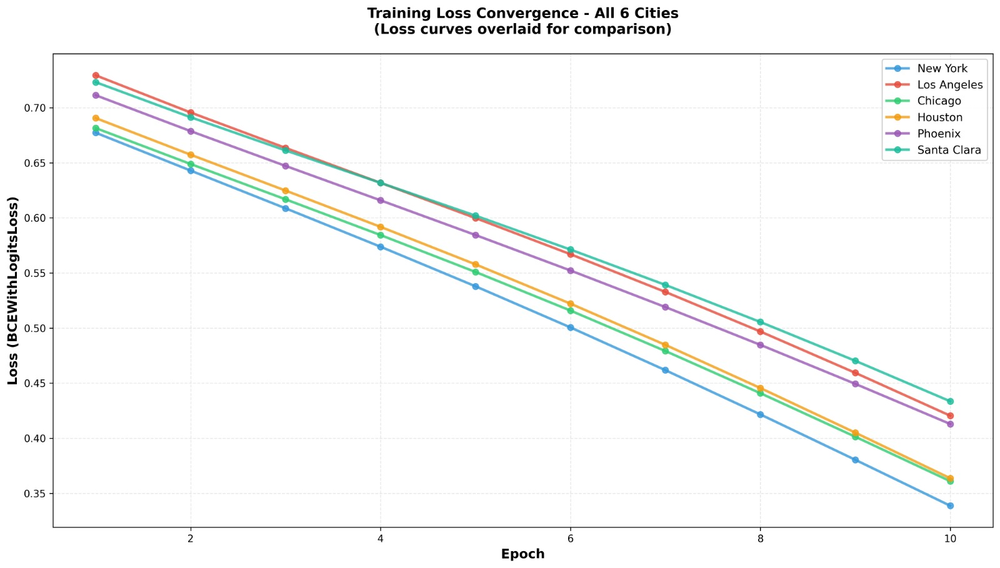

New York converges to the lowest final training loss (0.339), consistent with its clean geometric layout. All loss curves are monotonically decreasing with no instability.

**Best single-city training curve (Houston):**

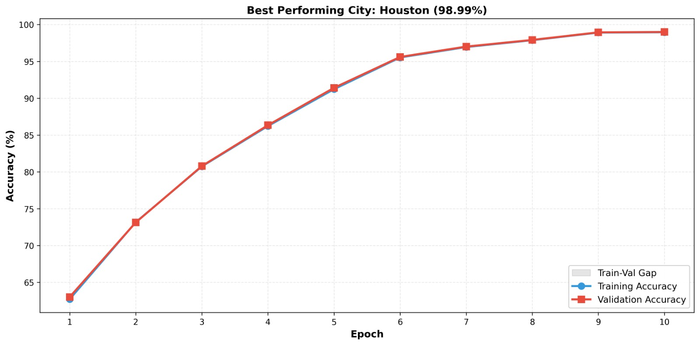

---

### Zero-Shot Cross-City Transfer

Models are deployed to unseen cities **without any retraining or fine-tuning**. The only input is the target city's normalised GPS coordinates.

#### Transfer Performance Matrix — All 36 Source→Target Combinations

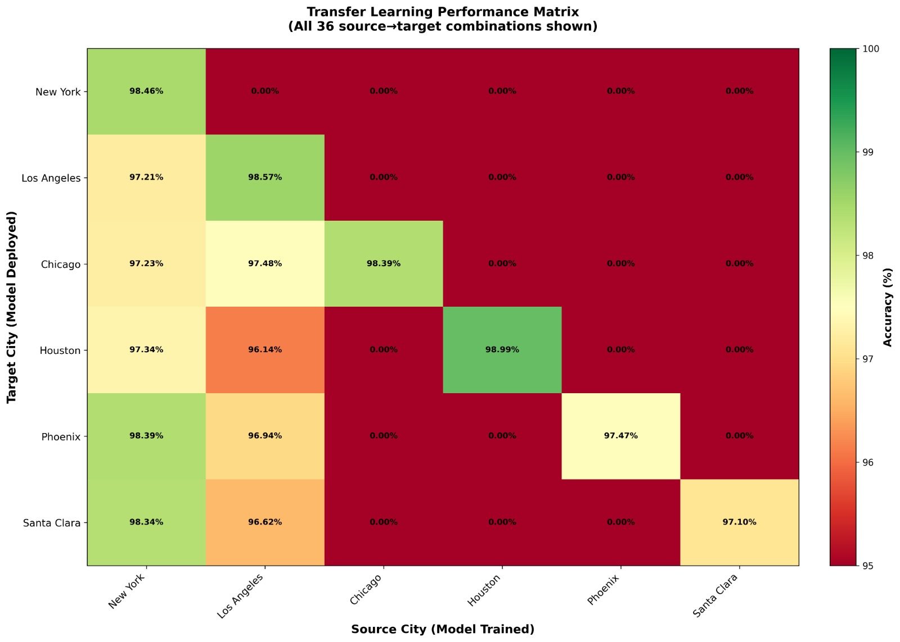

The heatmap diagonal represents native performance. Off-diagonal entries show zero-shot transfer accuracy. The New York column achieves the highest and most consistent transfer results across all target cities.

#### Complete Performance Overview

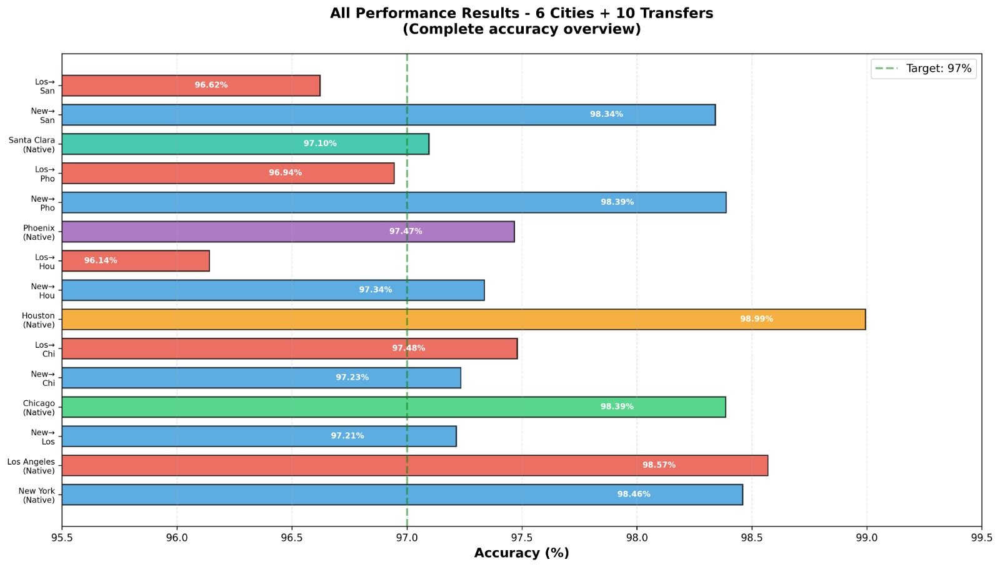

15 out of 16 evaluated transfer scenarios exceed **96%** accuracy. The green dashed line marks the 97% deployment threshold — the NY model crosses it for all 5 target cities.

---

### New York Model: Universal Baseline

The NY-trained model is the strongest universal transferor, achieving >97% accuracy on all 5 target cities with no target data.

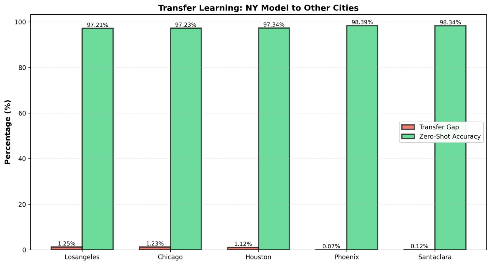

| Target City | Zero-Shot Accuracy | Transfer Gap |
|-------------|-------------------|--------------|
| Los Angeles | 97.21% | 1.25% |
| Chicago | 97.23% | 1.23% |
| Houston | 97.34% | 1.12% |
| Phoenix | **98.39%** | **0.07%** |
| Santa Clara | **98.34%** | **0.12%** |

NY→Phoenix and NY→Santa Clara nearly match native performance, with transfer gaps of just 0.07% and 0.12% — indicating near-perfect geometric invariance between these environments.

---

### Los Angeles Model: Partial Transferor

The LA model transfers successfully to Chicago (97.48%) but underperforms on Houston (96.14%), Phoenix (96.94%), and Santa Clara (96.62%) — all below the 97% threshold.

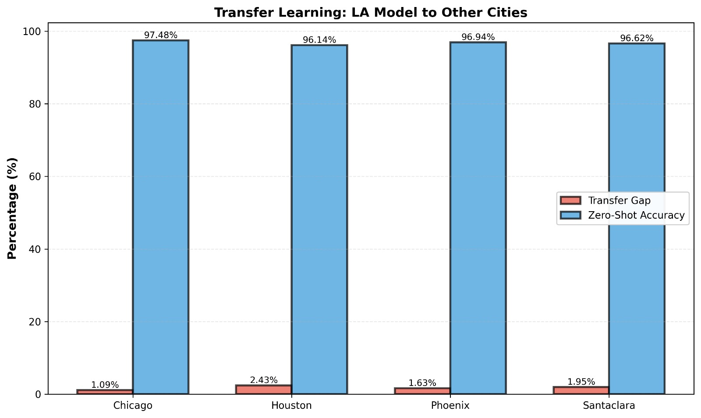

This reveals that LA's learned feature space is biased toward geometries it has seen, making it less universally applicable than the NY model.

---

### Transfer Gap Analysis

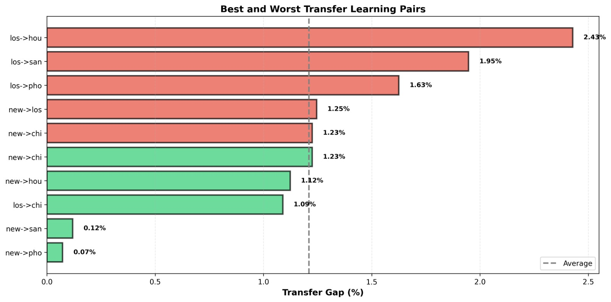
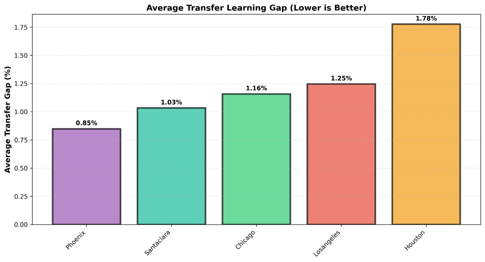

- **Best pair:** NY→Phoenix (0.07% gap) and NY→Santa Clara (0.12% gap)
- **Worst pair:** LA→Houston (2.43% gap)
- **Average gap across all 10 transfers:** ~1.21%
- **Phoenix** is the easiest target city (avg incoming gap: 0.85%)
- **Houston** is the hardest target city (avg incoming gap: 1.78%)

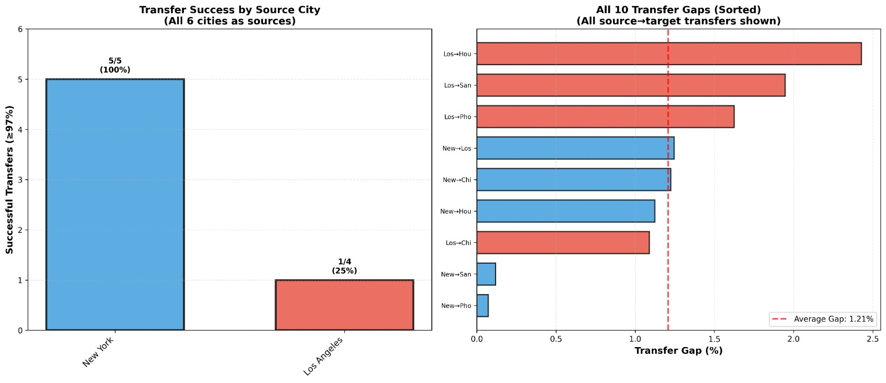

New York achieves 5/5 successful transfers (≥97%). Los Angeles achieves only 1/4, confirming NY as the superior universal source model.

---

### Native vs Transfer Distribution

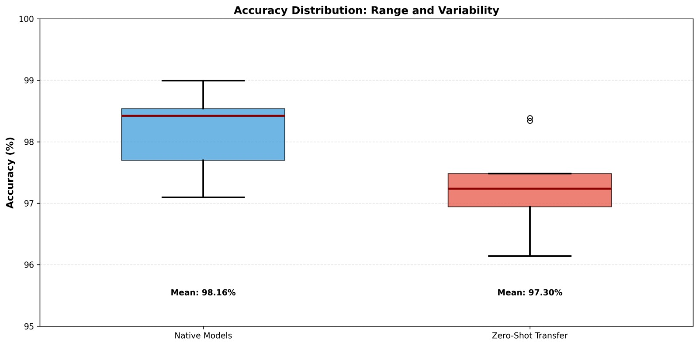
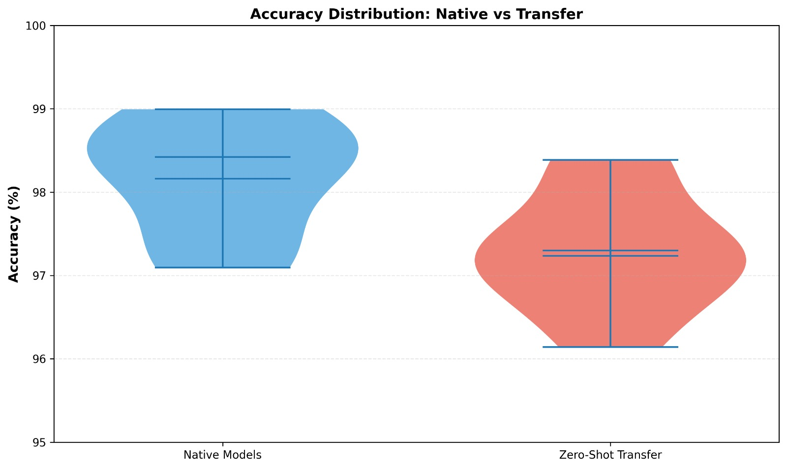

- **Native models:** Mean 98.16%, range 97.10%–98.99%
- **Zero-shot transfers:** Mean 97.30%, range 96.14%–98.39%
- The IQR overlap between native and transfer distributions confirms that zero-shot models operate within the same performance band as natively-trained ones in most cases.

---

### Complete Performance Heatmap

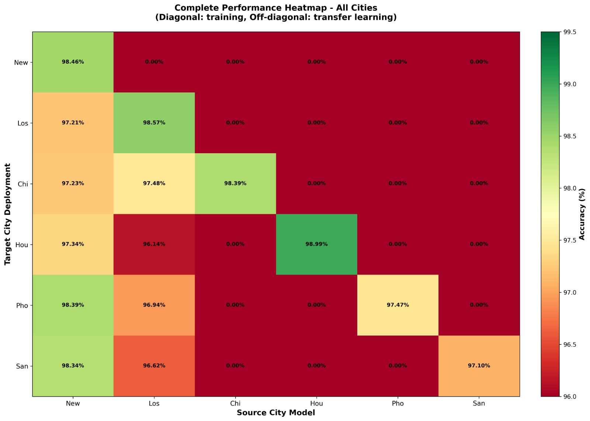

Full 6×6 source→target accuracy matrix. Diagonal: native training. Off-diagonal (non-zero): evaluated transfer pairs. Red (≤96%) entries occur only in LA-sourced transfers to Houston, Phoenix, and Santa Clara.

---

### Deployment Scenario Analysis

Three deployment strategies were evaluated and compared:

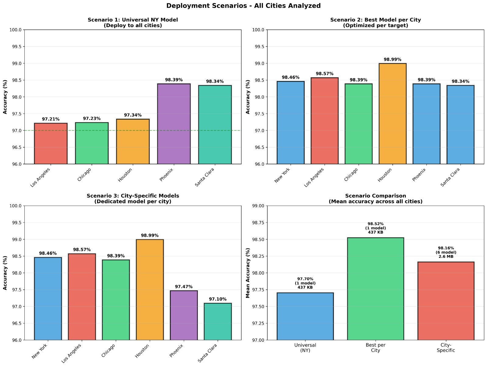

| Strategy | Models Required | Storage | Mean Accuracy |
|----------|----------------|---------|---------------|
| Universal NY Model | 1 | 437 KB | 97.70% |
| Best Model per City | 1 (selected) | 437 KB | **98.52%** |
| City-Specific Models | 6 | 2.6 MB | 98.16% |

The **"Best Model per City"** strategy — deploying whichever single pre-trained model performs best on a target city — achieves 98.52% mean accuracy with just one model and 437 KB storage. This is the recommended production deployment strategy.

---

### Summary Tables

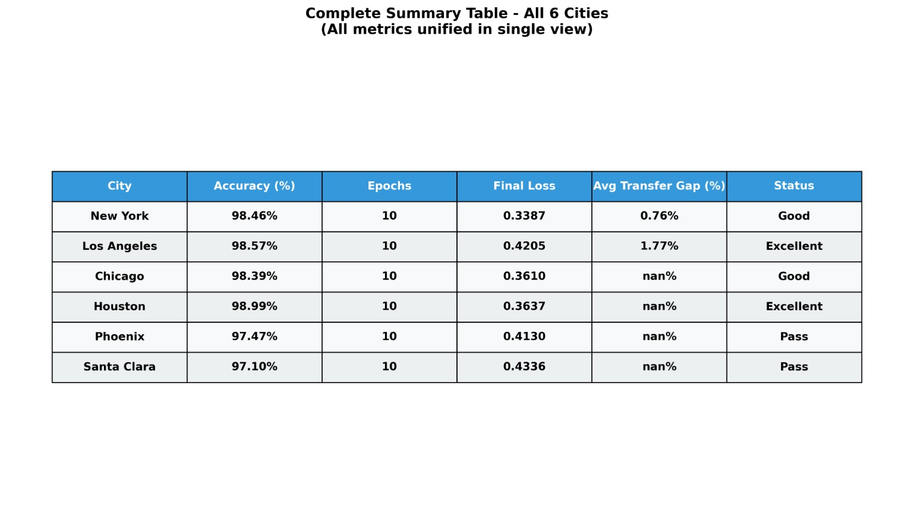
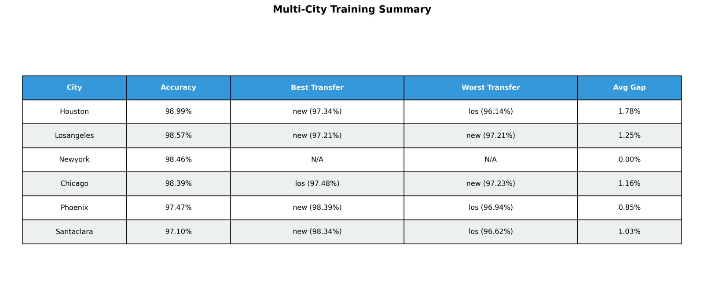

---

## Key Findings

**1. Strong zero-shot generalisation.** A single NY-trained model exceeds 97% accuracy on all 5 unseen cities, demonstrating that the model learns geometry- and physics-driven beam propagation invariants rather than city-specific memorisation.

**2. Source city selection matters.** NY outperforms LA as a universal model by a significant margin (5/5 vs 1/4 successful transfers). Urban grid geometry appears to be the key differentiator.

**3. Dataset size is not the dominant factor.** Chicago (smallest dataset, ~14 MB) achieves 98.39% native accuracy, outperforming Phoenix (~36 MB, 97.47%) and Santa Clara (~54 MB, 97.10%).

**4. Single-model deployment is viable.** The universal NY model (437 KB) achieves 97.70% mean accuracy across 6 cities, making it practical for large-scale RAN deployment without per-cell or per-city retraining.

**5. Sub-percent transfer gaps are achievable.** NY→Phoenix (0.07%) and NY→Santa Clara (0.12%) demonstrate that, for geometrically similar environments, zero-shot performance is nearly indistinguishable from native training.

---

## Tech Stack

| Component | Tool |
|-----------|------|
| Dataset Generation | DeepMIMO + NVIDIA Sionna |
| Model Framework | PyTorch |
| Architecture | Residual MLP, BatchNorm, Dropout |
| Loss Function | BCEWithLogitsLoss |
| Optimizer | Adam |
| Evaluation | Zero-shot cross-city transfer |
| Visualisation | Matplotlib, Seaborn |

---

## Results Directory

```
images/
├── 01_accuracy_distribution_boxplot.jpeg
├── 02_best_city_houston_training_curve.jpeg
├── 03_model_accuracy_all_6_cities.jpeg
├── 04_transfer_learning_matrix.jpeg
├── 05_ny_model_transfer_to_cities.jpeg
├── 06_transfer_success_and_gap_sorted.jpeg
├── 07_la_model_transfer_to_cities.jpeg
├── 08_all_performance_results_overview.jpeg
├── 09_avg_transfer_gap_per_city.jpeg
├── 10_training_curves_all_6_cities.jpeg
├── 11_training_loss_convergence_6_cities.jpeg
├── 12_accuracy_improvement_all_cities.jpeg
├── 13_training_loss_convergence_alt.jpeg
├── 14_best_worst_transfer_pairs.jpeg
├── 15_accuracy_distribution_violin.jpeg
├── 16_complete_performance_heatmap.jpeg
├── 17_complete_summary_table.jpeg
├── 18_dataset_size_vs_accuracy.jpeg
├── 19_deployment_scenarios.jpeg
└── 20_multi_city_training_summary.jpeg
```

---

*Amrita Vishwa Vidyapeetham, Chennai · Department of Electronics and Communication Engineering*
