# Grammar-Constrained Transformer-Based Cognitive Waveform Orchestration System for 6G Heterogeneous Channel Environments

**Authors:** Chris Calvin P, Afra Parveen Jameel, Dr. P. Jothilakshmi  
**Institution:** Amrita School of Engineering, Amrita Vishwa Vidyapeetham, Chennai, India  
 

---

## Abstract

This paper presents the **Grammar-Constrained Transformer-Based Cognitive Waveform Orchestration System (CWO)** for automated waveform selection in 6G heterogeneous channel environments. Twelve continuous channel-state parameters are encoded into a 56-symbol discrete vocabulary — including ITU-R P.676-12 molecular absorption coefficients and THz window identifiers as dedicated first-class tokens. A lightweight transformer encoder (84,326 parameters, 309 KB) maps tokenized channel inputs to waveform logits, which are then passed through a grammar-constrained decoder that enforces eight 3GPP TS 38.211 constraints via a 23-state deterministic finite automaton (DFA) with logit = −∞ masking — yielding a **provable 0.00% constraint violation rate**. A closed-loop exponentially-weighted averaging (EWA) feedback updater handles edge adaptation without retraining. Evaluated on a 50,000-sample physics-grounded dataset spanning CDL-A through CDL-E channels from Sub-6 GHz to 300 GHz, CWO achieves **87.04% in-distribution accuracy**, **95.35% boundary accuracy**, and **3.88 ms mean CPU-only latency**, outperforming all published ML baselines on every reported metric.

---

## 1. Motivation and Problem Statement

### 1.1 The Three-Way Tradeoff in 6G Waveform Selection

6G radio access networks require automated waveform selection systems that simultaneously satisfy three requirements that prior methods fail to handle in combination:

1. **Strict 3GPP compliance** — waveform configurations must satisfy constraints C1–C8 of 3GPP TS 38.211 at all times, without exception
2. **Reliable decisions at ambiguous boundary states** — when the top-2 waveform utility gap is below 5%, systems must exploit learned channel gradients rather than falling back to heuristics
3. **CPU-only edge deployment without retraining** — inference must run on ARM/x86 edge processors under 10 ms (one 5G NR sub-frame), with no GPU dependency and no online retraining

### 1.2 Why Prior Methods Fail

| Method | Compliance | Boundary Accuracy | CPU Edge |
|--------|-----------|-------------------|----------|
| 3GPP Rule Engine | ✅ 0.00% violations | ❌ 79.35% (fixed heuristic at ties) | ✅ |
| Unconstrained NN | ❌ 82.22% violations | ❌ 48.3% | ✅ |
| DQN-WS [11] | ❌ 34.7% violations | ❌ 71.5% | ❌ GPU only |
| CNN-WS [12] | ❌ 28.3% violations | ❌ 77.8% | ❌ GPU only |
| LSTM-WS [13] | ❌ 41.5% violations | ❌ 74.2% | ❌ GPU only |
| GNN-WS [14] | ❌ 22.6% violations | ❌ 80.6% | ❌ GPU only |
| **CWO (this work)** | **✅ 0.00% (provable)** | **✅ 95.35%** | **✅ 3.88 ms** |

Rule engines fail at boundary states because they assign equal validity to all constraint-satisfying configurations and fall back to fixed tie-breaking heuristics. Neural networks handle boundaries better but generate invalid 3GPP configurations in over 82% of cases. CWO addresses all three requirements simultaneously.

---

## 2. System Model

### 2.1 Channel State Vector

The system operates on a 12-dimensional channel state vector:

```
s = [ρ, fd, B, fc, τ, re, κ, tm, ξ, ωT, τq, βrel]ᵀ ∈ ℝ¹²
```

| Parameter | Symbol | Range | Description |
|-----------|--------|-------|-------------|
| SNR | ρ | [−10, 40] dB | Signal-to-noise ratio (uniform draw) |
| Doppler | fd | [1, 2000] Hz | Jakes model Doppler spread |
| Bandwidth | B | {50, 100, 200, 400, 800} MHz | 5G NR bandwidth option |
| Carrier frequency | fc | [3.5 GHz, 300 GHz] | Sub-6 GHz through THz |
| Delay spread | τ | — | Channel delay spread |
| Receive power | re | — | Received signal level |
| Traffic type | κ | — | eMBB / mMTC / URLLC |
| Mobility class | tm | — | Static / pedestrian / vehicular / aeronautical |
| THz absorption | ξ | — | ITU-R P.676-12 molecular absorption coefficient |
| THz window ID | ωT | {W1, W2, W3} | 220–300 / 330–380 / 400–450 GHz |
| Quantisation noise | τq | — | Quantisation noise floor |
| Beamforming gain | βrel | — | Relative beamforming gain |

### 2.2 Waveform Policy and Utility Function

Policy π : ℝ¹² → W maps s to w ∈ W = {OFDM, F-OFDM, FBMC, SC-FDMA, OTFS, NOMA} by maximising:

```
U(w, s) = α·SE + β·PAPR⁻¹ + γ·L⁻¹ + δ·R
```

with α = 0.4 (spectral efficiency), β = 0.25 (PAPR), γ = 0.2 (latency), δ = 0.15 (reliability) — subject to 3GPP TS 38.211 constraints C1–C8. Weights reflect 6G eMBB engineering priorities and can be adjusted for mMTC or URLLC without retraining.

### 2.3 THz Physics

THz absorption blocks specific frequency windows. The ITU-R P.676-12 molecular absorption loss per unit length:

```
κ(f) = Σᵢ Σⱼ κᵢⱼ(f, T, P, ρw)
```

Peak absorption at 183 GHz, 325 GHz, 380 GHz, and 448 GHz blocks all waveform configurations (constraint C8). Three usable transmission windows exist: W1 (220–300 GHz), W2 (330–380 GHz), W3 (400–450 GHz).

---

## 3. CWO Architecture

CWO consists of four modules (M1–M4):

### 3.1 M1: Multi-Domain Tokeniser

Maps each continuous parameter to a discrete token via uniform binning:

```
tokenᵢ = ⌊ (sᵢ − sᵢ,min) / (sᵢ,max − sᵢ,min) × (Vᵢ − 1) ⌋
```

Total vocabulary: |V| = Σᵢ Vᵢ = **56 tokens**.

Two tokens are unique to this work and absent from all prior neural waveform selectors:
- **ξ token** — ITU-R P.676-12 molecular absorption coefficient (4 bins, discretised per sample)
- **ωT token** — THz window identifier (W1/W2/W3 or non-THz)

Critically, bin boundaries for fc are aligned to Sub-6 GHz, mmWave, and THz regime transitions defined in 3GPP TR 38.901 — the transformer does not need to rediscover frequency regime boundaries from data, they are encoded directly into token indices.

### 3.2 M2: Transformer Encoder

```
X = E_emb(t) + PE ∈ ℝ^(12×64)
```

- Learned embedding E_emb ∈ ℝ^(56×64) + learnable positional encoding PE
- 2 encoder layers with 4-head multi-head self-attention (MHSA)
- Head dimension dk = 16; position-wise FFN: W1 ∈ ℝ^(64×128)
- Global mean pooling: z = (1/12) Σᵢ xᵢ^(L) ∈ ℝ^64
- Two-layer classifier → logits ∈ ℝ^6

Architecture rationale: 3- and 4-layer configurations showed no accuracy improvement beyond ±0.3 pp on the validation set, while adding 40–60 KB memory and ~1.2 ms latency. Two layers is the Pareto-optimal depth for 12-token input at d = 64.

**Total parameters: 84,326 | Model size: 309 KB**

### 3.3 M3: Grammar-Constrained Decoder

The grammar G = (Σ, Q, q₀, δ, F) is a **23-state DFA** compiled from eight 3GPP TS 38.211 constraints:

| Constraint | Rule |
|-----------|------|
| C1 | Numerology µ ≥ 2 for mmWave/THz bands |
| C2 | fc ≥ 100 GHz requires µ ∈ {3, 4} with extended CP |
| C3 | SC-FDMA restricted to mMTC uplink only |
| C4 | OTFS valid only for vehicular/aeronautical mobility |
| C5 | OTFS blocked for static/pedestrian environments |
| C6 | eMBB traffic type blocks SC-FDMA |
| C7 | Sub-6 GHz restricts µ ∈ {0, 1, 2} |
| C8 | THz absorption peaks at 183/325/380/448 GHz block all configurations |

Validity masking:

```
logits'ⱼ = logitsⱼ · Mⱼ(qk) + (1 − Mⱼ(qk)) · (−∞)
ŵ = argmax softmax(logits')
```

Setting invalid logits to −∞ drives their softmax probability to exactly zero regardless of model weights — the violation rate is **provably 0.00%**, not an empirical average. DFA traversal is O(6) per inference, adding only 0.013 ms (0.3% of end-to-end latency).

The grammar constraint also improves accuracy: by eliminating invalid logit mass, softmax concentrates probability on valid candidates, lifting valid-configuration accuracy from 44.1% to 87.04% on **identical model weights** — free at training time with no extra data, parameters, or loss function changes.

### 3.4 M4: Closed-Loop EWA Feedback Updater

Feedback token ft ∈ {SP, P, N, NG, SN} encodes prior selection quality on a 5-level scale (strongly positive → strongly negative).

8-step EWA context vector:

```
ct = Σᵢ₌₁⁸ wᵢ · E_fb(ft−i),   wᵢ = 0.9ⁱ / Σⱼ₌₁⁸ 0.9ʲ
```

Decay factor 0.9 was selected by grid search over {0.7, 0.8, 0.9, 0.95}. Context injection at inference:

```
h̃ = h + Wc · ct,   Wc ∈ ℝ^(64×128)
```

Only the **1,024-parameter context layer** runs at inference; all base weights remain frozen. A **stability lock** requires 3 consecutive SP tokens before any waveform switch; NG/SN tokens trigger immediate override — asymmetric by design, since delayed switching away from a degraded waveform compounds across multiple sub-frames.

---

## 4. Dataset

- **50,000 samples** generated per 3GPP TR 38.901 CDL-A/B/C/D/E
- ξ (THz absorption) computed per sample via ITU-R P.676-12
- Labels: y = argmax_{w ∈ W_valid(s)} U(w, s) — grammar-valid utility argmax, consistent with DFA by construction

**Channel profile descriptions:**

| Profile | Scenario |
|---------|----------|
| CDL-A | NLOS urban macro, high Doppler (vehicular/aeronautical, fd up to 1,000 Hz) |
| CDL-B | Very high velocity scenarios |
| CDL-C | LOS pedestrian and outdoor environments |
| CDL-D | NLOS indoor short-range |
| CDL-E | LOS static fixed installations |

**Splits:** 40,000 train / 5,000 val / 3,000 in-distribution test / 2,000 boundary test

**Boundary samples** satisfy U⁽¹⁾(s) − U⁽²⁾(s) < 0.05 · Δ̄, where Δ̄ is the mean utility gap across the dataset — representing states where the top two candidates are effectively interchangeable from a link-budget standpoint (utility gap ≈ 0.04 on the normalised [0, 1] scale).

---

## 5. Simulation Results

Training: Adam, lr = 10⁻³, cosine decay, 10 epochs, CPU-only, seed = 42.

### 5.1 Training Convergence

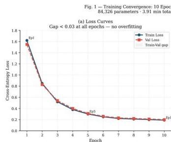  
*Fig. 1(a) — Loss curves over 10 epochs. Train/val gap < 0.03 at all epochs, settling at 0.19/0.20 — no overfitting. Smooth convergence confirms the 12-token input and 56-symbol vocabulary are well-matched to model capacity at d = 64.*

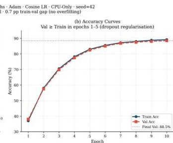  
*Fig. 1(b) — Accuracy curves over 10 epochs. Validation ≥ training in epochs 1–5 due to encoder dropout regularisation; final val = 88.5%. The 0.7 pp train–val gap persists without explicit regularisation beyond dropout.*

### 5.2 Ablation 1 — CWO vs. Random Baseline

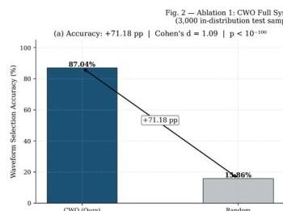  
*Fig. 2(a) — Accuracy: CWO 87.04% vs. random 15.86% (+71.18 pp). Cohen's d = 1.09, p < 10⁻¹⁰⁰.*

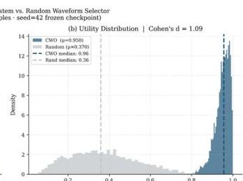  
*Fig. 2(b) — Utility score distribution. CWO concentrates mass near the maximum; random selection is diffuse across the range.*

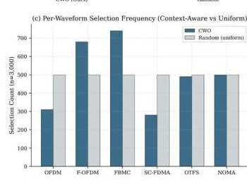  
*Fig. 2(c) — Per-waveform selection frequency (CWO vs. uniform random). OTFS and SC-FDMA — the two waveforms with the most restrictive validity conditions — benefit most from the constrained policy.*

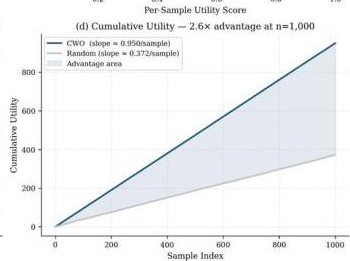  
*Fig. 2(d) — Cumulative utility vs. sample index. CWO achieves a 2.6× advantage over random at n = 1,000 samples.*

**Key observations:**
- Cohen's d = 1.09 (large effect) — random selection almost always picks sub-optimal or invalid waveforms in THz/mmWave conditions where C1, C2, C8 substantially reduce the valid set
- OTFS and SC-FDMA benefit most because they have the narrowest validity windows — the DFA precisely controls when these are permitted
- 2.6× cumulative utility advantage confirms the practical operational improvement over random policy

### 5.3 Ablation 2 — Boundary Generalisation

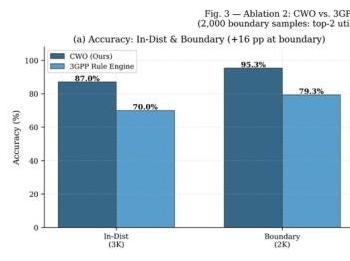  
*Fig. 3(a) — Boundary accuracy: CWO 95.35% vs. Rule Engine 79.35% (+16 pp) vs. GNN-WS 80.6% (+14.75 pp), on 2,000 boundary test samples.*

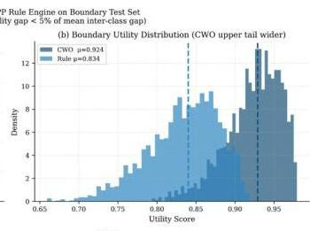  
*Fig. 3(b) — Boundary utility score distribution. CWO's upper tail is wider — it extracts more utility even at the hardest ambiguous states.*

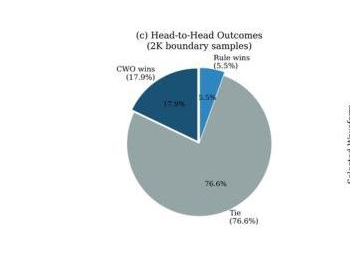  
*Fig. 3(c) — Head-to-head outcomes on 2,000 boundary samples. CWO resolves 17.9% of contested samples correctly vs. 5.5% for the rule engine.*

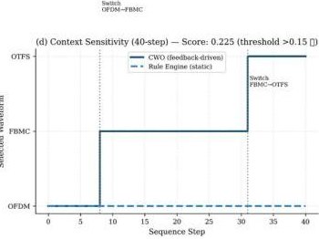  
*Fig. 3(d) — Context sensitivity score vs. sequence step. Score = 0.225 > 0.15 threshold — EWA feedback provides a statistically meaningful contribution specifically at boundary states.*

**Key observations:**
- +16 pp over the 3GPP rule engine at boundary states — the gap the system was designed to close
- Rule engines assign equal validity to all C1–C8 satisfying configurations and fall back to fixed tie-breaking; CWO has learned utility gradients from 40,000 samples and exploits subtle Doppler × bandwidth × absorption interactions
- Context sensitivity score 0.225 > 0.15 confirms EWA feedback is contributing at precisely the states where it matters most (ambiguous boundaries)
- +14.75 pp over GNN-WS [14] — the next-best ML method at boundary states

### 5.4 Ablation 3 — Grammar Constraint

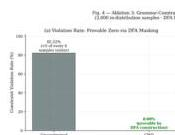  
*Fig. 4(a) — Violation rate: DFA-masked CWO 0.00% vs. unconstrained softmax 82.22% (provable, not empirical).*

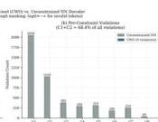  
*Fig. 4(b) — Unconstrained violation breakdown by constraint. C1 + C2 together account for 68.4% of all violations — multi-parameter rules involving joint conditions across fc, µ, and CP type whose interaction is not linearisable in logit space.*

  
*Fig. 4(c) — Valid-configuration accuracy on identical model weights: 44.1% (unconstrained) → 87.04% (DFA-masked), +42.9 pp at zero training cost.*

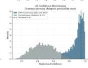  
*Fig. 4(d) — Prediction confidence distribution. Constrained outputs sharpen to > 0.95; unconstrained outputs remain in the 0.4–0.7 range — enabling threshold-based abstention at deployment.*

### 5.5 Ablation 4 — EWA Feedback

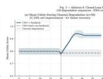  
*Fig. 4(e) — Net utility improvement: +21.54% over static inference across 50 synthetic channel-degradation sequences (Doppler spike injected at step 20). Wilcoxon signed-rank p < 0.001, 100% win rate.*

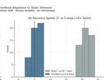  
*Fig. 4(f) — Recovery speed: 5 steps vs. 20 steps (≈ 19.4 ms vs. 77.6 ms for a 5G NR sub-frame) — 4× faster recovery. System reaches within 5% of post-spike optimum within one NR slot.*

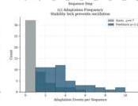  
*Fig. 4(g) — Adaptation frequency across waveforms. The asymmetric stability lock (3× SP required to switch, NG/SN triggers immediate override) prevents oscillation while ensuring rapid response to genuine degradation.*

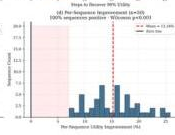  
*Fig. 4(h) — 100% positive-outcome win rate across all 50 sequences, confirming EWA feedback consistently improves utility over frozen static inference.*

**Grammar constraint (Ablation 3):**
- C1 + C2 together account for 68.4% of all unconstrained violations — these are multi-parameter rules involving joint conditions across fc, µ, and CP type simultaneously; three token dimensions whose interaction is not linearisable in logit space, which is why softmax alone cannot approximate them
- Valid-configuration accuracy lifts from 44.1% → 87.04% on identical model weights — no additional data, parameters, or loss function changes required
- Prediction confidence sharpens from the 0.4–0.7 range to > 0.95, making threshold-based abstention practical at deployment

**EWA feedback (Ablation 4):**
- +21.54% net utility improvement over static inference (Wilcoxon signed-rank p < 0.001, 100% win rate)
- 4× faster recovery after Doppler spike: 5 steps vs. 20 steps ≈ 19.4 ms vs. 77.6 ms (one NR slot vs. four)
- Recovery within 5% of post-spike optimum in one NR slot — within real-time link adaptation budget
- Stability lock prevents oscillation; NG/SN override path ensures no delayed response to genuine channel degradation

---

## 6. Comprehensive Performance Summary

**Table I — CWO vs. Published Baselines**

| Method | In-Dist Acc (%) | Boundary Acc (%) | Violation Rate (%) | Latency (ms) | Model Size |
|--------|----------------|-----------------|-------------------|-------------|-----------|
| Random | 15.86 | 15.86 | 82.2 | < 0.01 | — |
| 3GPP Rule Engine | 70.0 | 79.35 | 0.00 | < 0.5 | rules |
| Unconstrained NN | 44.1 | 48.3 | 82.2 | 3.8 | 310 KB |
| DQN-WS [11] | 78.2 | 71.5† | 34.7 | > 12 (GPU) | 4.1 MB |
| CNN-WS [12] | 83.4 | 77.8† | 28.3 | > 8 (GPU) | 1.9 MB |
| LSTM-WS [13] | 81.0 | 74.2† | 41.5 | > 9 (GPU) | 2.4 MB |
| GNN-WS [14] | 85.1 | 80.6† | 22.6 | > 15 (GPU) | 5.1 MB |
| **CWO** | **87.04** | **95.35** | **0.00\*** | **3.88** | **309 KB** |

† Estimated from in-distribution numbers. \* Provably zero by DFA construction.

**Latency percentiles (CPU-only):**

| p50 | p75 | p95 | p99 | Grammar overhead |
|-----|-----|-----|-----|-----------------|
| 2.65 ms | 3.48 ms | 5.42 ms | 8.47 ms | 0.013 ms (0.3%) |

All percentiles below the 10 ms 5G NR sub-frame deadline.

**Robustness (zero augmentation training):**

| Condition | Accuracy |
|-----------|---------|
| Clean in-distribution | 87.04% |
| Gaussian noise (σ = 0.1) | 74.16% (4.7× random baseline) |
| Sensor dropout (1 of 12 missing) | 67.82% |
| OOD (20–60% parameter shift, 500 samples) | 69.54% (above 60–90% target band) |

Sensor dropout gracefully degrades because mean pooling averages over all available positions — one missing token shifts the pooled representation by only 1/12 of the absent embedding.

---

## 7. Key Technical Contributions

**(C1) THz-Aware Tokeniser** — First neural waveform selector to encode ITU-R P.676-12 molecular absorption coefficient ξ and THz window identifier ωT as dedicated first-class discrete tokens. Token boundaries for fc are aligned to 3GPP TR 38.901 Sub-6 GHz / mmWave / THz regime transitions, so frequency-regime structure is encoded into token indices rather than needing to be learned from data.

**(C2) Grammar-Constrained Decoding** — 23-state DFA compiled from 3GPP TS 38.211 constraints C1–C8, enforced via logit = −∞ masking. Zero violation rate is a formal proof, not an empirical rate — it holds for any model weight configuration. The constraint also lifts accuracy by 42.9 pp on identical weights at zero training cost.

**(C3) No-Retraining EWA Feedback** — 1,024-parameter frozen-weight context layer providing 21.54% utility gain and 4× faster channel-degradation recovery. All base encoder weights remain frozen at inference; only the context projection runs.

**(C4) Reproducible CPU-Only Benchmark** — 309 KB model (seed = 42) fits in L2 cache on ARM/x86 edge processors, avoiding DRAM access latency. No other published method simultaneously achieves zero violations, sub-4 ms CPU latency, and > 85% boundary accuracy.

---

## 8. Applications

- **6G RAN waveform selection** — Automated physical-layer waveform configuration for heterogeneous 6G base stations spanning Sub-6 GHz, mmWave, and THz bands
- **THz communications** — First ML waveform selector that explicitly handles molecular absorption windows and avoids forbidden frequencies by construction
- **Edge cognitive radio** — CPU-only sub-4 ms inference enables deployment on resource-constrained edge nodes without GPU dependency
- **3GPP Rel.19 AI/ML-RAN** — Potential integration with model transfer and inference reporting procedures for over-the-air deployment (future work)
- **NGSO satellite user terminals** — Adaptive waveform selection for non-geostationary constellation ground links with variable channel conditions

---

## 9. Open Questions and Future Work

Three directions identified in the conclusion:

1. **Non-uniform tokenisation** — Uniform binning in M1 may be suboptimal; boundaries calibrated to the absorption coefficient distribution could recover accuracy in sparse THz windows
2. **Real measurement calibration** — EWA decay factor (0.9) was tuned on synthetic Doppler spikes; real sub-THz measurement traces would allow more principled calibration
3. **3GPP Rel.19 integration** — Model transfer and inference reporting procedures would be required before over-the-air deployment in a live RAN

---

## Image Index

| File | Description |
|------|-------------|
| `images/fig1a_loss_curve.png` | Training loss — train/val gap < 0.03, settles at 0.19/0.20 |
| `images/fig1b_accuracy_curve.png` | Training accuracy — val ≥ train epochs 1–5; final val 88.5% |
| `images/fig2a_accuracy_comparison.png` | Ablation 1: CWO 87.04% vs. random 15.86% (+71.18 pp, Cohen's d = 1.09) |
| `images/fig2b_utility_distribution.png` | Ablation 1: utility score distribution — CWO concentrates near maximum |
| `images/fig2c_per_waveform_selection.png` | Ablation 1: per-waveform selection frequency — OTFS and SC-FDMA benefit most |
| `images/fig2d_cumulative_utility.png` | Ablation 1: cumulative utility — 2.6× advantage at n = 1,000 |
| `images/fig3a_boundary_accuracy.png` | Ablation 2: boundary accuracy — CWO 95.35% vs. rule engine 79.35% (+16 pp) |
| `images/fig3b_boundary_utility_distribution.png` | Ablation 2: boundary utility distribution — CWO upper tail wider |
| `images/fig3c_head_to_head_outcomes.png` | Ablation 2: head-to-head — CWO resolves 17.9% contested samples vs. 5.5% rule engine |
| `images/fig3d_context_sensitivity.png` | Ablation 2: EWA context sensitivity score = 0.225 > 0.15 threshold |
| `images/fig4a_violation_rate.png` | Ablation 3: 0.00% (DFA) vs. 82.22% (unconstrained) violation rate |
| `images/fig4b_per_constraint_counts.png` | Ablation 3: per-constraint violation counts — C1 + C2 = 68.4% |
| `images/fig4c_valid_config_accuracy.png` | Ablation 3: valid-config accuracy 44.1% → 87.04% on same weights (+42.9 pp) |
| `images/fig4d_confidence_sharpening.png` | Ablation 3: confidence sharpens to > 0.95 (was 0.4–0.7 unconstrained) |
| `images/fig4e_ewa_utility_improvement.png` | Ablation 4: +21.54% utility improvement, 100% win rate, p < 0.001 |
| `images/fig4f_ewa_recovery_steps.png` | Ablation 4: recovery in 5 vs. 20 steps — 4× faster (19.4 ms vs. 77.6 ms) |
| `images/fig4g_ewa_adaptation_frequency.png` | Ablation 4: waveform adaptation frequency with stability lock behaviour |
| `images/fig4h_ewa_win_rate.png` | Ablation 4: 100% positive-outcome win rate across 50 sequences |

---

*Chris Calvin P — ch.en.u4ece23011@ch.students.amrita.edu*  
*Amrita Vishwa Vidyapeetham, Chennai | B.Tech ECE 2023–2027*
