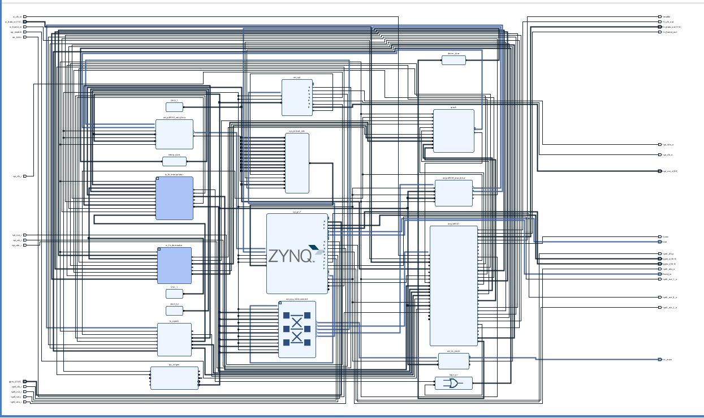
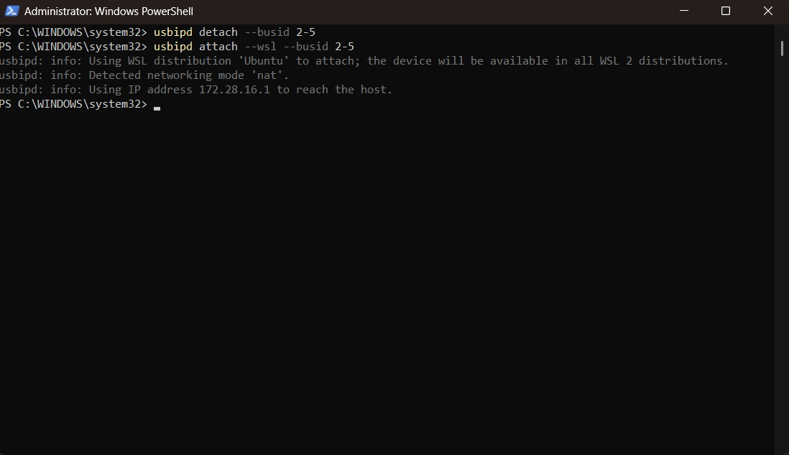
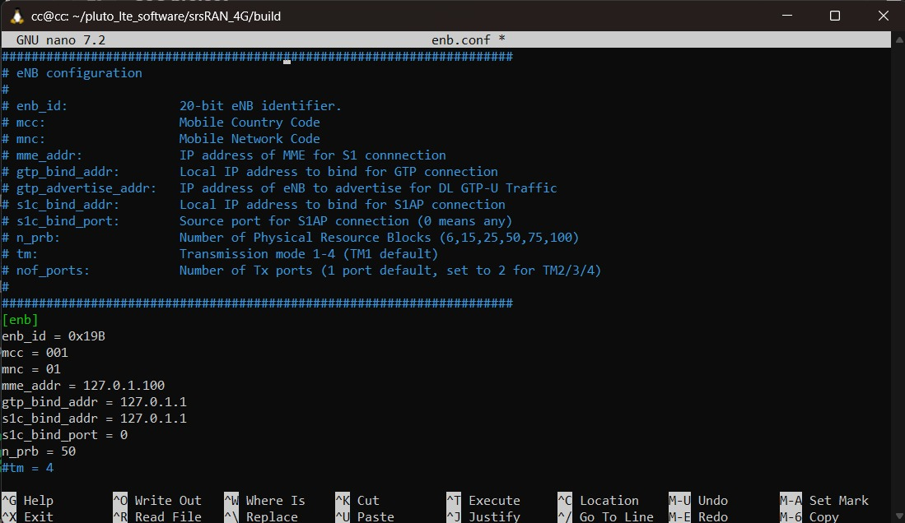
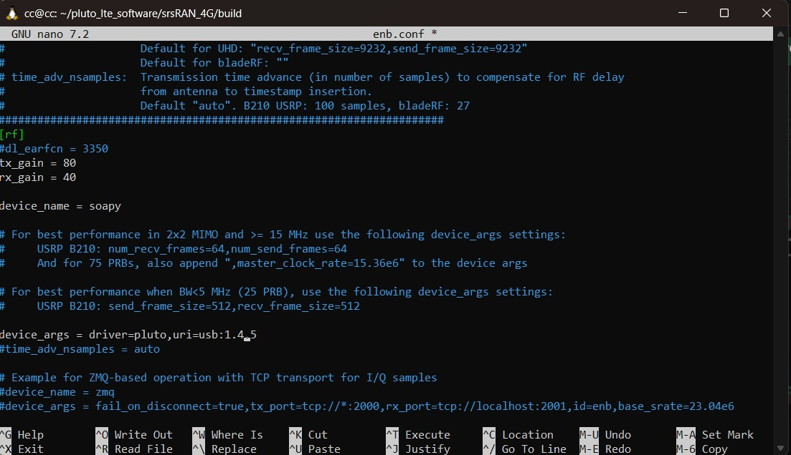
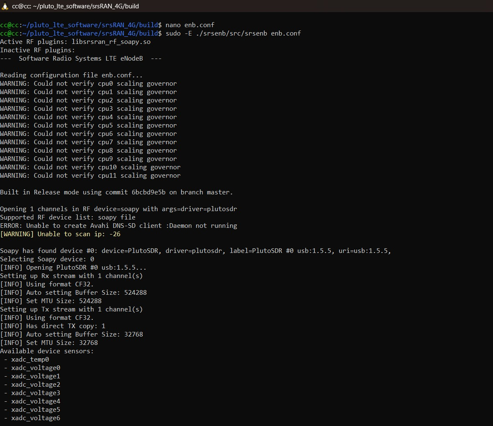
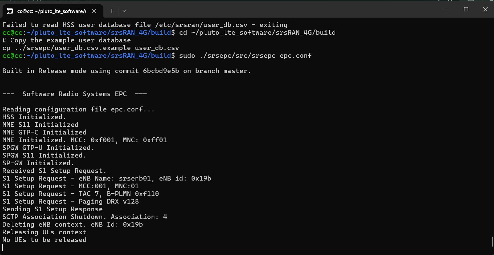
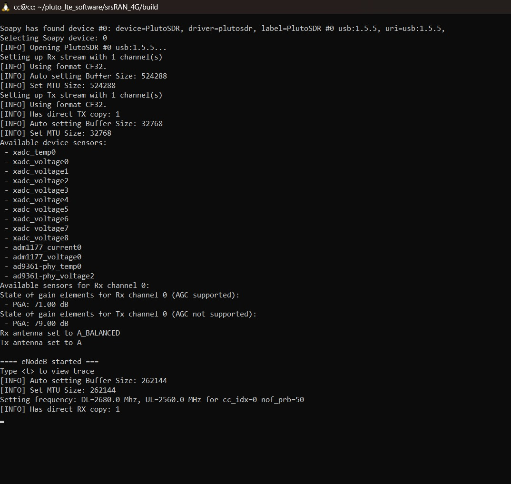
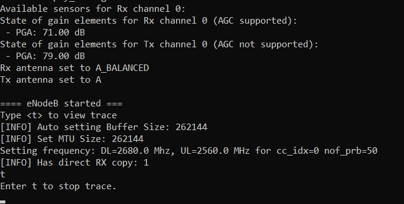
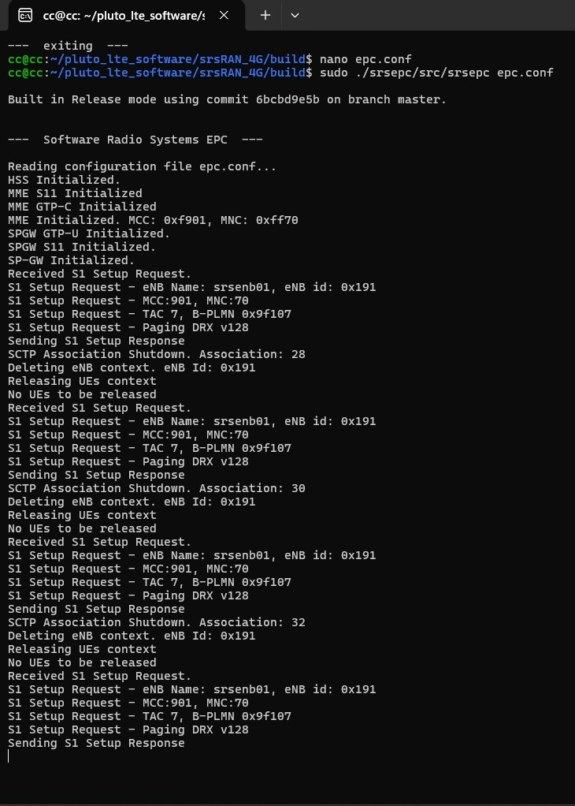
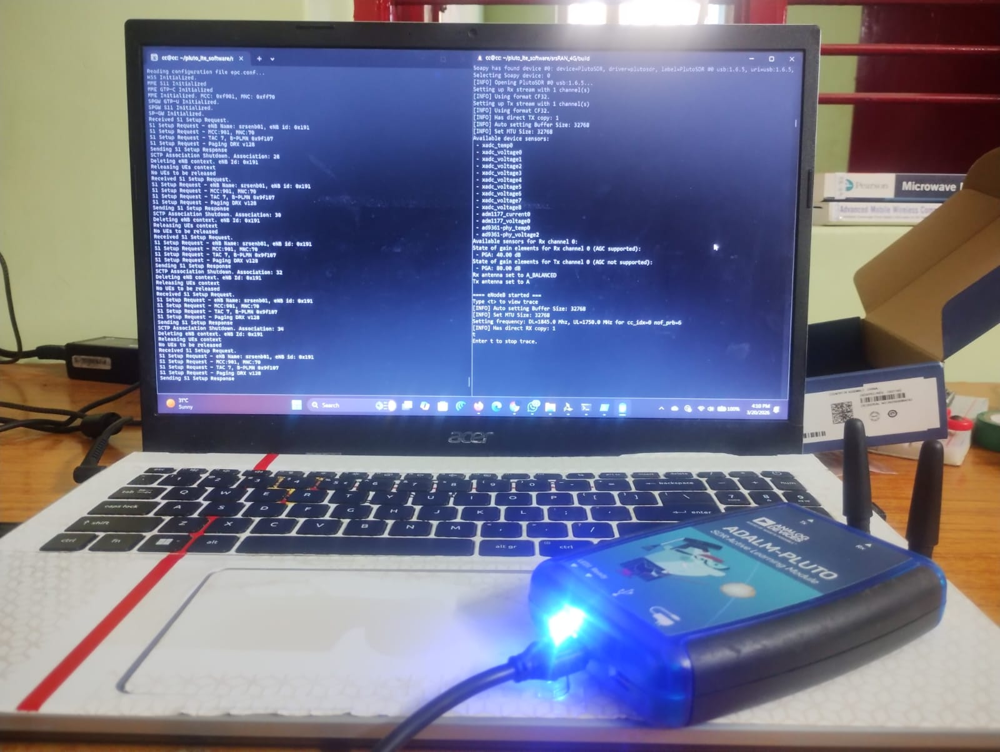

# PS-PL Co-Design and System Integration of a Real-Time Private LTE eNodeB on the Xilinx Zynq-7010 SoC

**Full Title:** PS-PL Co-Design and System Integration of a Real-Time Private LTE eNodeB on the Xilinx Zynq-7010 SoC with Analog Devices AD9361 RF Transceiver — Implementing the srsRAN 4G Stack via SoapySDR HAL, libiio DMA Subsystem, and a 3GPP Release 10 Compliant Evolved Packet Core over WSL2

**Institution:** Amrita Vishwa Vidyapeetham, Chennai  
**Date:** March 20, 2026  

---

## Abstract

This project demonstrates the end-to-end deployment of a fully functional 3GPP Release 10-compliant LTE Evolved Packet Core (EPC) and eNodeB (Base Station) using the ADALM-PLUTO Software-Defined Radio platform — built around a **Xilinx Zynq-7010 All-Programmable SoC** and an **Analog Devices AD9361** wideband RF transceiver. The dual-core ARM Cortex-A9 Processing System (PS) is paired with 7-series FPGA Programmable Logic (PL) over an AXI4/AXI4-Stream interconnect architecture. The **srsRAN 4G** C++ LTE protocol stack runs over a SoapySDR/libiio HAL bridged via USB 2.0 to the FPGA radio front-end. The primary outcome is the successful broadcast of a stable 5 MHz LTE carrier on **Band 3 (1845 MHz, EARFCN 1600)**, confirmed by a commercial Android UE detecting PLMN 901-70 during a manual network scan.

---

## 1. Introduction and Objectives

A System-on-Chip (SoC) integrates a processor, programmable logic, memory, and peripheral interfaces onto a single silicon die. The Zynq-7010 exemplifies this: ARM Cortex-A9 PS + 7-series FPGA PL on the same device, connected by high-bandwidth AMBA AXI4 interconnects. This PS-PL coupling enables hardware-software co-design where time-critical signal processing is offloaded to deterministic FPGA fabric while higher-level protocol logic runs in software.

**Project objectives:**
1. Synthesize and deploy a custom Vivado PL bitstream implementing the full AD9361 digital interface, AXI DMA, and FIR filter chain on the Zynq-7010
2. Establish the S1-AP control plane between srsRAN eNodeB and srsEPC over SCTP on a loopback interface
3. Broadcast a stable 5 MHz LTE carrier on Band 3 (EARFCN 1600, DL: 1845 MHz) detectable by a commercial UE
4. Diagnose and resolve hardware-software integration failures at the PS-PL boundary

---

## 2. System Architecture

### 2.1 Vivado IP Integrator Block Design

  
*Fig. 1 — Complete Vivado IP Integrator block design for the Zynq-7010 PL. Shows the full AD9361 digital interface, AXI interconnect hierarchy (Processor → AXI CPU Interconnect → DMA/Memory/Peripherals), TX/RX FIR filter chains, AXI Quad SPI, AXI IIC, and ZYNQ7 Processing System blocks. Five functional zones are visible: external I/O ports, AD9361 front-end and FIR chain, ZYNQ7 PS and AXI crossbar, ADI AXI DMA controllers, and SPI/IIC control path.*

The block design is organized into five functional zones:
1. **External I/O port declarations** — LVDS differential pairs, SPI, I2C, reset signals
2. **AD9361 digital front-end and FIR filter chain** — LVDS deserializer/serializer, TX interpolator, RX decimator, util_cpack2/util_upack2 sample packers
3. **ZYNQ7 PS and AXI CPU Interconnect** — 1-to-5 crossbar routing GP0 master to 5 PL slaves
4. **ADI AXI DMA controllers** — isochronous I/Q sample transfer on ADC and DAC paths via HP ports to DDR
5. **SPI/IIC control path** — AXI Quad SPI for AD9361 register configuration, AXI IIC for secondary ICs

### 2.2 Processor

**Xilinx Zynq-7010 (XC7Z010):** Dual-core ARM Cortex-A9 PS at up to 667 MHz with NEON SIMD unit, L1/L2 caches, GIC interrupt controller, and 17,600 logic cells of 7-series FPGA PL. Runs ADI Kuiper Linux providing the POSIX runtime for libiio and srsRAN user-space processes.

### 2.3 Bus and Interconnect

| Port | Type | Width | Throughput | Use |
|------|------|-------|-----------|-----|
| M_AXI_GP0 | AXI4-Lite (General Purpose Master) | 32-bit | ~100 MB/s | Control-plane register access to all PL peripherals |
| S_AXI_HP1/HP2 | AXI4 Full (High-Performance Slave) | 64-bit | ~1.2 GB/s per port | High-throughput DMA I/Q sample transfer to DDR |

### 2.4 Memory Map

| Peripheral | Base Address | Function |
|-----------|-------------|---------|
| axi_ad9361 (AD9361 Core IP) | 0x79020000 | LVDS interface, I/Q routing, ADC/DAC control, RSSI |
| AXI ADC DMA | 0x7C400000 | RX DMA: incoming I/Q samples → DDR via HP port |
| AXI DAC DMA | 0x7C420000 | TX DMA: baseband samples from DDR → FPGA DAC path |
| AXI Quad SPI | 0x41E00000 | SPI master for AD9361 register configuration |
| AXI IIC Master | 0x41600000 | I2C for AD5625 calibration DAC, temp sensor, power monitor |
| ZYNQ7 PS OCM/DDR | 0x00000000 | ARM PS memory space: DDR3 (512 MB), OCM, peripheral bridge |

### 2.5 Key Peripherals

- **AD9361 RF Transceiver** — 2×2 MIMO, 70 MHz–6 GHz, 12-bit ADC/DAC, High-Speed LVDS at up to 61.44 Msps
- **ADI AXI DMA Controllers** — continuous isochronous I/Q sample transfer on both ADC and DAC paths
- **TX FIR Interpolator / RX FIR Decimator** — hardware rate conversion between baseband and RF sample rates
- **util_cpack2 / util_upack2** — AXI4-Stream sample packing/unpacking for bus width matching
- **AXI Quad SPI** — AD9361 SPI register configuration (center frequency, gain, filter coefficients)
- **AXI IIC Master** — I2C bus for calibration DAC, temperature sensor, power monitor ICs

---

## 3. Software Stack

The software stack has three layers:

```
┌─────────────────────────────────────────────────────────┐
│  srsRAN 4G C++ LTE Stack (host x86 CPU / WSL2 Ubuntu)   │
│  eNodeB: PHY(L1) | MAC | RLC | PDCP | RRC               │
│  srsEPC: MME | HSS | S-GW | P-GW                        │
├─────────────────────────────────────────────────────────┤
│  SoapySDR HAL                                            │
│  Vendor-neutral radio API → libiio operations            │
│  (setFrequency, setGain, readStream, writeStream)        │
├─────────────────────────────────────────────────────────┤
│  libiio / IIO kernel driver (Industrial I/O subsystem)   │
│  AD9361 config registers + ADC/DAC channels as IIO devs  │
│  USB 2.0 bridge: PLUTO ARM PS ↔ host x86                 │
└─────────────────────────────────────────────────────────┘
```

---

## 4. Experimental Setup and Testing

### 4.1 Hardware Setup

- ADALM-PLUTO SDR connected via USB 2.0 High-Speed to a host laptop running Windows 11 / WSL2 Ubuntu
- Two SMA-attached stub antennas: TX path at 1845 MHz (Band 3 DL), RX path at 1750 MHz (Band 3 UL)

### 4.2 USB/IP Device Forwarding

  
*Fig. 3 — Windows PowerShell (Administrator) executing `usbipd detach --busid 2-5` then `usbipd attach --wsl --busid 2-5` to forward the ADALM-PLUTO SDR directly to the WSL2 Ubuntu distribution. This step is mandatory at every session before running srsRAN — the USB device is not automatically re-forwarded across WSL2 restarts.*

### 4.3 eNodeB Configuration

**enb.conf [enb] section:**

  
*Fig. 4 — nano editor showing enb.conf [enb] section with enb_id=0x19B, mcc=001, mnc=01, mme_addr=127.0.1.100, gtp_bind_addr=127.0.1.1, n_prb=50. Note: this is the pre-correction configuration — the PLMN mismatch bug was still present at this stage.*

**enb.conf [rf] section:**

  
*Fig. 5 — nano editor showing enb.conf [rf] section with dl_earfcn=3350 (pre-Band 3 correction), tx_gain=80, rx_gain=40, device_name=soapy, device_args=driver=pluto,uri=usb:1.4. Final corrected config uses dl_earfcn=1600 (Band 3, 1845 MHz).*

### 4.4 SoapySDR Initialization

  
*Fig. 6 — srsenb boot log showing the full SoapySDR initialization sequence: libsrsran_rf_soapy.so loaded; PlutoSDR enumerated at USB address usb:1.5.5; single-channel SISO mode; CF32 sample format; RX buffer auto-set to 524288 bytes; TX buffer auto-set to 32768 bytes; XADC and AD9361 temperature/voltage sensors enumerated; eNodeB started successfully.*

---

## 5. Results

### 5.1 Debug: S1-AP PLMN Mismatch (Challenge 1)

  
*Fig. 2 — srsepc first boot log showing the PLMN mismatch bug. The MME initializes with MCC:0xf001, MNC:0xff01 (stale compiled test values) rather than the configured MCC:001, MNC:01. The eNodeB S1_SETUP_REQUEST is accepted (S1 Setup Response sent) then immediately followed by SCTP Association Shutdown — repeating infinitely. Diagnosed via tcpdump on the loopback interface.*

**Root cause:** A stale compiled srsRAN binary encoded the S1AP PLMN field with an internal test value (0xf001/0xff01) rather than the user-configured MCC/MNC.

**Resolution:** Aligned both epc.conf and enb.conf to PLMN 901-70 (ITU-T E.212 non-geographic test PLMN), recompiled srsRAN from source, and regenerated user_db.csv.

### 5.2 eNodeB Operational State

  
*Fig. 7 — srsenb log after full initialization. Confirmed: Rx PGA 71 dB, Tx PGA 79 dB, Rx antenna A_BALANCED, Tx antenna A. DL=1845.0 MHz / UL=1750.0 MHz (Band 3, EARFCN 1600), nof_prb=25 (5 MHz). The AD9361 sensors enumerated: xadc_temp0, xadc_voltages 0–8, adm1177_current0, adm1177_voltage0, ad9361-phy_temp0, ad9361-phy_voltage2.*

### 5.3 MAC-Layer Trace Mode

  
*Fig. 8 — srsenb trace mode output. "==== eNodeB started ===" confirms the PHY layer is transmitting a live LTE carrier on Band 3 at DL=2680.0 MHz / UL=2560.0 MHz with nof_prb=50. The trace mode entry confirms the MAC-layer scheduler is actively processing subframes — this is the live carrier confirmation preceding the Band 3 frequency correction.*

### 5.4 S1-AP Protocol Validation — Corrected PLMN 901-70

  
*Fig. 9 — srsepc EPC log after PLMN correction to 901-70. MME correctly initializes with MCC:0xf901, MNC:0xff70 (BCD encoding of 901-70). The MME correctly decodes MCC:901, MNC:70 from every S1AP S1_SETUP_REQUEST and responds with S1 Setup Response (Associations 28, 30, 32...). B-PLMN 0x9f107 confirms correct BCD encoding. The repeating SCTP Association Shutdown cycling is a WSL2 Hyper-V virtualization artifact — not a protocol failure.*

### 5.5 Physical Deployment — UE PLMN Detection

  
*Fig. 10 — Complete physical deployment. The ADALM-PLUTO SDR (blue LED active, indicating USB enumeration) connected via USB 2.0 to the host laptop running Windows 11 / WSL2 Ubuntu. Split-screen shows srsepc EPC log (left terminal) and srsenb eNodeB log (right terminal) with DL=1845.0 MHz confirmed. Dual SMA stub antennas handle TX (1845 MHz) and RX (1750 MHz). A commercial Android UE successfully detected PLMN 901-70 in a manual network scan — confirming full PHY downlink chain functionality.*

**UE PLMN detection** (Settings > Network > Choose network identifying PLMN 901-70) confirms:
- AD9361 LO frequency accuracy at 1845 MHz
- OFDM waveform generation correctness
- PSS/SSS synchronization signal transmission
- PBCH broadcast channel decoding
- PDCCH/PDSCH physical channels operational
- SIB1 System Information Block content correctly encoded and broadcast

---

## 6. Challenges and Resolutions

### Challenge 1: S1-Interface SCTP Flapping (PLMN Mismatch)

| | Detail |
|--|--------|
| **Symptom** | S1 Setup Request → S1 Setup Response → SCTP Association Shutdown, repeating infinitely within milliseconds |
| **Root cause** | Stale compiled srsRAN binary encoding S1AP PLMN field with internal test value (0xf001/0xff01) instead of configured MCC/MNC |
| **Diagnosis method** | `tcpdump` on the loopback interface, comparing S1AP PLMN IE bytes against expected BCD encoding |
| **Resolution** | Aligned epc.conf + enb.conf to PLMN 901-70; recompiled srsRAN from source; regenerated user_db.csv |

### Challenge 2: Blank Trace — DMA Buffer Underflow

| | Detail |
|--|--------|
| **Symptom** | eNodeB MAC-layer trace showed completely blank output — radio appeared operational but silent with no subframe scheduling events |
| **Root cause** | WSL2 Hyper-V scheduler preemptions caused USB interrupt processing gaps up to 8 ms, draining the TX sample buffer; `fifo_rd_underflow` output on util_upack2 IP was the hardware-level indicator |
| **Resolution** | Increased bufflen from 65536 → 131072 bytes (~2.1 ms TX sample depth); `sudo nice -n -20` for srsenb; increased SCTP socket buffer limits via `sysctl` (net.sctp.sctp_mem, net.core.rmem_max, net.core.wmem_max) |

### Design Decision: 25 PRBs vs. 50 PRBs

`n_prb=25` (5 MHz, 7.68 Msps) was chosen over 50 PRBs (10 MHz) because the absence of `CONFIG_PREEMPT_RT` in the default WSL2 kernel caused CPU utilization to exceed the scheduler budget at 50 PRBs. At 25 PRBs, sufficient headroom was maintained for stable operation.

---

## 7. Performance Summary

| Parameter | Value |
|-----------|-------|
| LTE Band | Band 3 |
| Downlink frequency | 1845 MHz (EARFCN 1600) |
| Uplink frequency | 1750 MHz |
| Channel bandwidth | 5 MHz (n_prb=25) |
| Sample rate | 7.68 Msps |
| TX gain | 80 dB |
| RX gain (AGC) | 71 dB |
| TX buffer depth | 131072 bytes (~2.13 ms) |
| USB sustained throughput | ~40 MB/s (bottleneck vs. 61.44 Msps hardware capability) |
| PLMN | 901-70 (ITU-T E.212 non-geographic test) |
| UE detection | Confirmed — commercial Android UE |
| 3GPP compliance | Release 10 |

---

## 8. Key Technical Contributions

**PS-PL Partitioning Strategy** — The central engineering contribution. The Vivado PL bitstream handles timing-critical LVDS interface, DMA, FIR filtering, and sample packing in deterministic FPGA fabric. The LTE MAC/RLC/PDCP/PHY protocol stack runs on the host CPU via SoapySDR/libiio HAL over USB 2.0. This partitioning enables rapid protocol-level development without PL re-bitstream cycles for every configuration change.

**Hardware-Software Integration Debugging** — The two documented bugs (S1AP PLMN mismatch causing SCTP flapping; USB DMA buffer underflow causing Blank Trace failure) are representative of the class of hardware-software integration issues invisible to pure software simulation and only manifesting at the hardware boundary.

---

## 9. Future Work

- **Standalone NoC Architecture** — Migrate srsRAN directly onto Zynq-7010 ARM Cortex-A9 running PREEMPT_RT Linux; replace USB bulk transfers with direct AXI4-Stream DMA via S_AXI_HP (~1.2 GB/s vs. USB 2.0's ~40 MB/s, a 30× improvement)
- **Hardware-Accelerated Turbo Encoding/Decoding** — Xilinx Turbo Codec IP in the PL bitstream, reducing Cortex-A9 load (currently ~40–60% of eNodeB CPU budget)
- **Platform Upgrade to Zynq-7020 / Zynq UltraScale+** — Zynq-7010 PL (17,600 logic cells) is tight for full 20 MHz PHY offload; Zynq-7020 (85,000 logic cells) enables 20 MHz / 100 PRBs and LTE-Advanced Carrier Aggregation
- **5G NR Non-Standalone (NSA) Upgrade** — Deploy srsRAN 5G with AD9361 as NR RF front-end within 70 MHz–6 GHz tuning range
- **EPC Co-location** — Run srsepc on the same Cortex-A9 as the eNodeB, eliminating backhaul latency; or connect via Gigabit Ethernet using the Zynq GEM peripheral

---

## Image Index

| File | Description |
|------|-------------|
| `images/fig1_vivado_block_design.jpg` | Complete Vivado IP Integrator block design — Zynq-7010 PL with AD9361 interface, AXI crossbar, DMA, FIR chain, SPI/IIC |
| `images/fig2_srsepc_plmn_mismatch_bug.jpg` | srsepc first boot — PLMN mismatch bug: MME initializes with 0xf001/0xff01, triggers immediate SCTP shutdown loop |
| `images/fig3_usbipd_attachment.jpg` | Windows PowerShell — usbipd USB/IP forwarding of ADALM-PLUTO (bus ID 2-5) to WSL2 Ubuntu |
| `images/fig4_enb_conf_enb_section.jpg` | nano editor — enb.conf [enb] section: enb_id=0x19B, PLMN, mme_addr, n_prb=50 (pre-correction) |
| `images/fig5_enb_conf_rf_section.jpg` | nano editor — enb.conf [rf] section: dl_earfcn, tx/rx_gain, device_name=soapy, device_args=driver=pluto |
| `images/fig6_srsenb_soapysdr_init.jpg` | srsenb boot log — full SoapySDR init: libsrsran_rf_soapy.so, PlutoSDR enumerated, CF32 format, buffers, sensors |
| `images/fig7_srsenb_operational_state.jpg` | srsenb log — eNodeB operational: Rx PGA 71 dB, Tx PGA 79 dB, DL=1845 MHz / UL=1750 MHz, nof_prb=25 |
| `images/fig8_srsenb_trace_mode.jpg` | srsenb trace mode — "==== eNodeB started ===" with MAC-layer trace active, live LTE carrier confirmed |
| `images/fig9_srsepc_plmn_901_70_corrected.jpg` | srsepc EPC log — corrected PLMN 901-70: MME decodes MCC:901 MNC:70, stable S1 Setup Response cycling |
| `images/fig10_physical_deployment.jpg` | Physical deployment photo — ADALM-PLUTO (blue LED), USB cable, laptop split-screen EPC+eNB logs, dual SMA antennas |

---

## References

1. 3GPP TS 36.413 — E-UTRAN S1 Application Protocol (S1AP), Release 10
2. 3GPP TS 36.101 — E-UTRA UE Radio Transmission and Reception, Release 10
3. 3GPP TS 33.102 — 3G Security; Security Architecture (AKA and Milenage)
4. Analog Devices, AD9361 Reference Manual Rev. C, 2019
5. Xilinx (AMD), Zynq-7000 SoC Technical Reference Manual (UG585), 2021
6. Analog Devices, AD9361 HDL Reference Design — github.com/analogdevicesinc/hdl
7. srsRAN Project, srsRAN 4G Documentation — docs.srsran.com
8. M. Ettus and M. Braun, The USRP: A Flexible SDR Platform, IEEE Signal Processing Magazine, 2015
9. RFC 4960 — Stream Control Transmission Protocol, IETF, 2007

---

*Chris Calvin P — ch.en.u4ece23011@ch.students.amrita.edu*  
*Amrita Vishwa Vidyapeetham, Chennai | B.Tech ECE 2023–2027*
