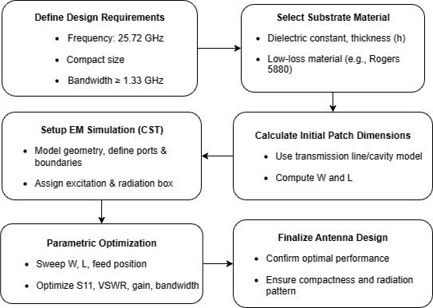
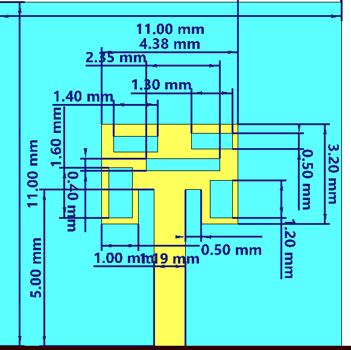
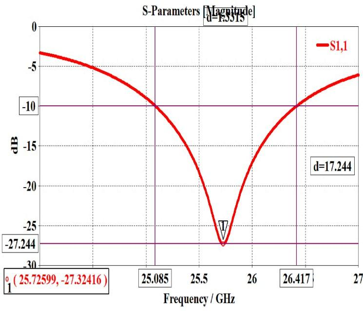
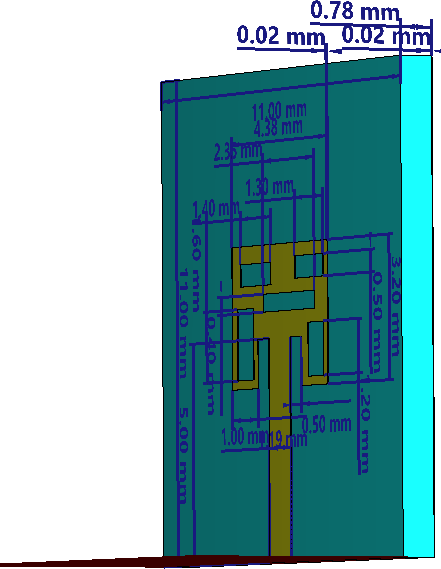
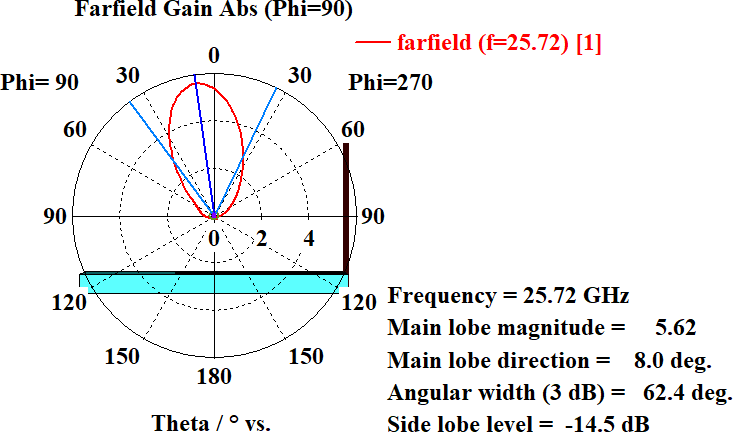
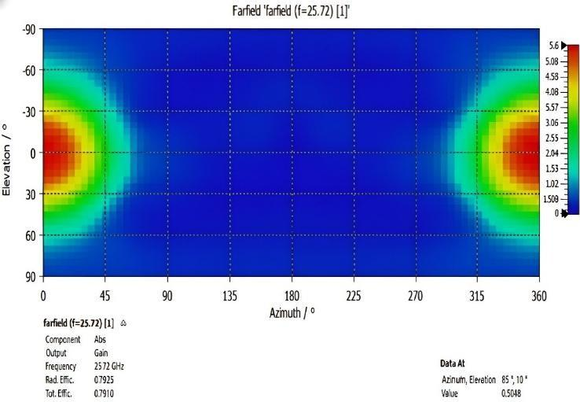
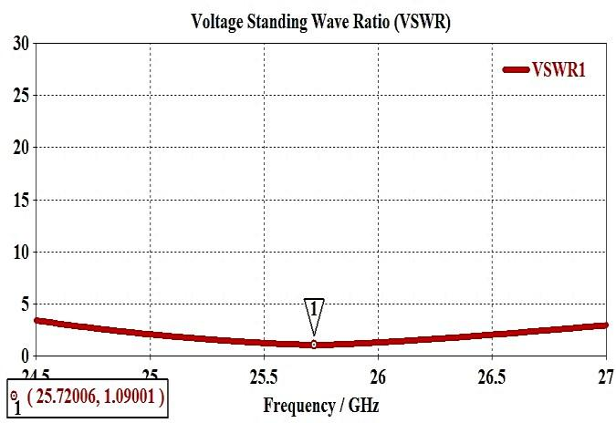
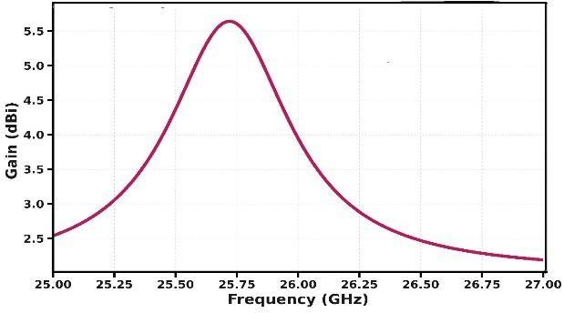
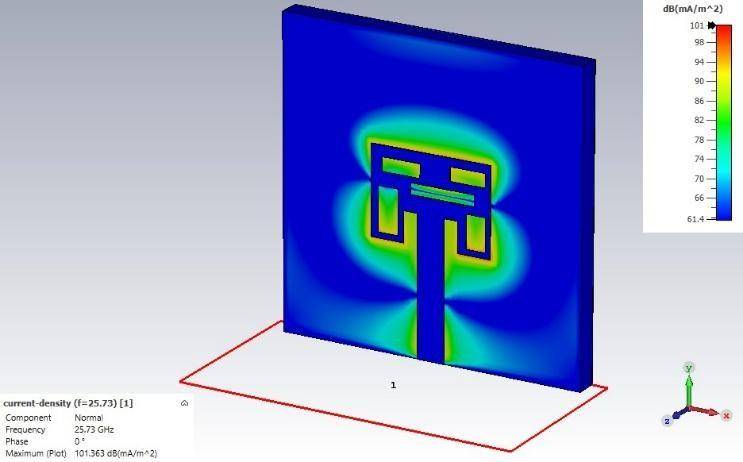
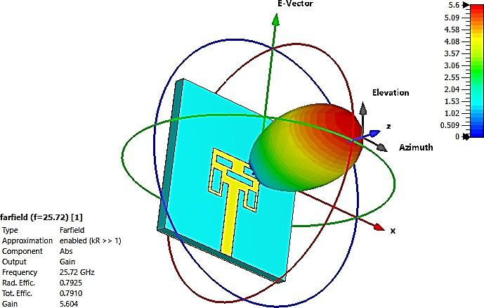

# Compact High-Frequency Antenna Design for 25.72 GHz Short-Range Radar Systems

**Authors:** Chris Calvin P, Afra Parveen Jameel, Dr. P. Jothilakshmi  
**Institution:** Amrita School of Engineering, Amrita Vishwa Vidyapeetham, Chennai, India  
**Published in:** 2025 IEEE International Conference on Electrical, Electronics, Communication and Computers (ELEXCOM)  
**DOI:** 10.1109/ELEXCOM67950.2025.11451614  

---

## Abstract

This paper presents a compact microstrip patch antenna designed for millimeter-wave short-range radar applications at 25.72 GHz. The antenna achieves a return loss (S11) of −27.32 dB with a 1.33 GHz impedance bandwidth, a peak gain of 5.64 dBi, a main lobe at 8.0°, and a total radiation efficiency of 79.17%. It is fabricated on Rogers RT/duroid 5880 substrate (εr = 2.2, h = 0.254 mm) and is optimized for compactness, making it suitable for deployment in industrial sensing, vehicular ADAS radar, and human presence detection systems.

---

## 1. Motivation and Background

The demand for compact, high-performance antennas has surged due to the rapid proliferation of short-range radar systems in:
- **Automotive sensing** — Advanced Driver Assistance Systems (ADAS), blind-spot monitoring, parking assistance
- **Industrial automation** — level probing, displacement measurement, conveyor monitoring
- **Security and surveillance** — human presence detection, perimeter monitoring

Operating at 25.72 GHz (millimeter-wave), these systems require antennas that simultaneously deliver high gain, low return loss, and compact footprints. Key engineering challenges at this frequency band include elevated dielectric losses, tight fabrication tolerances (even micron-level surface roughness degrades performance), and precise impedance matching. This work addresses these constraints through a carefully optimized multi-slotted T-shaped microstrip patch design.

---

## 2. Design Methodology

### 2.1 Design Flow

  
*Fig. 1 — Design flow for the 25.72 GHz microstrip patch antenna. The process begins with requirements definition, proceeds through substrate selection, initial dimension calculation using analytical models, full-wave EM simulation in CST Microwave Studio, and iterative parametric optimization of S11, VSWR, gain, and bandwidth.*

The antenna design followed a structured four-stage process:

1. **Requirements definition** — target frequency: 25.72 GHz; compact size; bandwidth ≥ 1.33 GHz
2. **Substrate selection** — Rogers RT/duroid 5880 (εr = 2.2, tan δ ≈ 0.0009, h = 0.254 mm) was chosen for its minimal dielectric loss and dimensional stability over wide temperature/frequency ranges
3. **Initial dimension calculation** — using the transmission line/cavity model equations to estimate patch width (W) and effective length (Leff)
4. **Full-wave simulation and parametric optimization** — CST Microwave Studio was used to refine feed geometry, slot positions, and patch dimensions for converged S-parameter, gain, and radiation pattern performance

### 2.2 Analytical Design Equations

The foundational microstrip patch design equations used are:

**Effective dielectric constant:**
```
ε_eff = (εr + 1)/2 + (εr − 1)/2 × (1 + 12h/W)^(−1/2)
```

**Patch width:**
```
W = c / (2fr × sqrt((εr + 1)/2))
```
Yielding an initial W ≈ 4.61 mm at 25.72 GHz.

**Length extension (fringing correction):**
```
ΔL/h = 0.412 × [(ε_eff + 0.3)(W/h + 0.264)] / [(ε_eff − 0.258)(W/h + 0.8)]
```

**Resonant frequency:**
```
fr = c / (2 × Leff × sqrt(ε_eff))
```

**VSWR:**
```
VSWR = (1 + |S11|_linear) / (1 − |S11|_linear)
```

These analytical values serve as an initial starting point; final dimensions (patch height: 11.00 mm, overall structure with feed network) are products of extensive iterative EM simulation to account for fringing fields and complex slot interactions.

### 2.3 Feed Network Design

A direct-contact inset microstrip feed line was implemented:
- **Feed line width:** 0.50 mm (50 Ω characteristic impedance)
- **Inset depth:** 1.19 mm
- **Inset width:** 1.00 mm

These parameters were parametrically swept and manually tuned to minimize S11 and transform the complex patch input impedance to 50 Ω. The inset feed configuration is critical — precise positioning at this frequency determines whether resonance locks at 25.72 GHz.

---

## 3. Antenna Structure

### 3.1 Simulated Patch Geometry

  
*Fig. 2 — Simulated multi-slotted T-shaped patch antenna in CST Microwave Studio, showing the radiating element on Rogers 5880 substrate.*

The antenna is a T-shaped microstrip patch with a complex multi-slot array etched into the radiating element. The use of slots is the key innovation that enables bandwidth enhancement and radiation pattern shaping without requiring an antenna array.

### 3.2 Detailed Dimensions

  
*Fig. 3 — Microstrip antenna structure with complete annotated dimensions, showing slot placements and feed geometry.*

| Parameter | Value |
|-----------|-------|
| Substrate | Rogers RT/duroid 5880 |
| Dielectric constant (εr) | 2.2 |
| Substrate thickness (h) | 0.254 mm |
| Patch height (overall) | 11.00 mm |
| Feed line width | 0.50 mm |
| Inset depth | 1.19 mm |
| Inset width | 1.00 mm |
| Patch size | 4.38 mm × 3.20 mm |

**Slot dimensions etched into the T-shaped patch:**

| Slot | Location | Purpose |
|------|----------|---------|
| 1.40 × 0.40 mm | Upper-left | Surface current disruption, lowers resonant frequency, broadens bandwidth |
| 1.60 × 0.40 mm | Lower-left | Excites neighboring modes, increases bandwidth and gain |
| 2.35 × 1.80 mm | Upper-right | Causes large resonance shift and mode excitation, increases gain at center frequency |
| 4.38 mm (transverse) | Center | Modal shaping to enhance upper bandwidth — key for mmWave suitability |
| 3.20 × 0.50 mm | Lower-right | Adjusts lobe position and field symmetry for directivity |

### 3.3 Ground Plane and Substrate Stack

  
*Fig. 4 — Cross-sectional view showing the ground plane, dielectric substrate, and radiating patch thickness dimensions.*

The antenna stack consists of:
1. Bottom ground plane (copper)
2. Rogers 5880 dielectric substrate (0.254 mm)
3. Top copper radiating patch with slot array

The ground plane dimensions and minimal edge clearances (0.02 mm annotated in the stack view) are critical for maintaining pattern symmetry and impedance stability at 25.72 GHz.

---

## 4. Simulation Results

All results were obtained using CST Microwave Studio with adaptive mesh refinement and absorbing (open) boundary conditions to accurately simulate an anechoic free-space environment.

### 4.1 Return Loss (S11)

  
*Fig. 5 — Simulated S11 (return loss) versus frequency. A deep resonant dip of −27.32 dB occurs at 25.725 GHz. The −10 dB bandwidth spans 25.087 GHz to 26.417 GHz, yielding a 1.33 GHz impedance bandwidth.*

**Key observations:**
- Resonant frequency: **25.725 GHz** (target: 25.72 GHz — near-perfect alignment)
- S11 at resonance: **−27.32 dB** (only ~0.19% of incident power reflected)
- −10 dB impedance bandwidth: **1.33 GHz** (25.087–26.417 GHz)
- The deep, sharp resonance confirms excellent impedance matching; the wide bandwidth (1.33 GHz) supports high-resolution radar pulse transmission and high data-rate mmWave communication

### 4.2 Voltage Standing Wave Ratio (VSWR)

  
*Fig. 6 — Simulated VSWR versus frequency. Minimum VSWR of 1.09 at 25.72 GHz, remaining below 2.0 across the entire impedance bandwidth.*

**Key observations:**
- Minimum VSWR: **1.09** at 25.72 GHz (ideal VSWR = 1.0)
- VSWR < 2.0 maintained across full 1.33 GHz bandwidth
- Near-unity VSWR confirms near-perfect power delivery to the radiating element with minimal reflected energy — critical for efficient radar front-end operation

### 4.3 Far-Field Polar Radiation Pattern

  
*Fig. 7 — Far-field polar gain pattern (Phi = 90° plane) at 25.72 GHz. Main lobe magnitude: 5.62 dBi at 8.0° from boresight. 3 dB angular width: 62.4°. Side lobe level: −14.5 dB.*

**Key observations:**
- **Main lobe gain:** 5.62 dBi at 8.0° from boresight (slight off-boresight pointing well-suited for angled radar coverage)
- **3 dB beamwidth:** 62.4° — moderately broad beam appropriate for short-range radar
- **Side lobe level:** −14.5 dB — strong suppression of off-axis radiation, reducing inter-channel interference and improving detection selectivity
- The directional main lobe is achieved purely through slot engineering, without requiring a multi-element array

### 4.4 Far-Field 2D Color Map

  
*Fig. 8 — 2D rectangular color map of far-field gain at 25.72 GHz. Horizontal axis: azimuth (0–360°); vertical axis: elevation (−90° to 90°). Red/orange = high gain regions (~5.6 dBi); blue = minimum radiation. Peak gain concentrated symmetrically at azimuth angles of ~45° and 315°.*

The 2D color map reveals the spatial gain distribution across all azimuth and elevation angles simultaneously. The antenna demonstrates controlled, focused energy distribution with minimal side radiation — a direct result of the slot-level surface current engineering.

### 4.5 3D Far-Field Radiation Pattern

  
*Fig. 9 — 3D visualization of far-field radiation pattern at 25.72 GHz. Single dominant lobe in an off-broadside direction. Radiation efficiency: 0.7943; Total efficiency: 0.7917; Peak gain: 5.639 dBi.*

The 3D pattern confirms a clean single dominant lobe with controlled back radiation. For radar systems, this shape is ideal — the focused forward lobe concentrates transmitted energy toward the target region while the low back-lobe level minimizes returns from behind the antenna.

### 4.6 Gain vs. Frequency

  
*Fig. 10 — Gain vs. frequency showing a narrowband peak of ~5.6 dBi at 25.7 GHz, dropping to ~3 dBi at 26.2 GHz and below 2.5 dBi beyond 26.8 GHz. Confirms efficient radiation is tightly coupled to the design frequency.*

---

## 5. Performance Summary

| Parameter | Simulated Value |
|-----------|----------------|
| Resonant frequency | 25.72 GHz |
| Return loss (S11) | −27.32 dB |
| −10 dB impedance bandwidth | 1.33 GHz (25.087–26.417 GHz) |
| VSWR at resonance | 1.09 |
| Peak gain | 5.64 dBi |
| Main lobe direction | 8.0° |
| 3 dB beamwidth | 62.4° (polar, Phi=90) / 45.9° (reported) |
| Side lobe level | −14.5 dB |
| Radiation efficiency | 79.43% |
| Total efficiency | 79.17% |
| Substrate | Rogers RT/duroid 5880 (εr = 2.2) |
| Patch footprint | 4.38 mm × 3.20 mm |

---

## 6. Comparison with Prior Art

| Antenna | Frequency (GHz) | Gain (dBi) | Bandwidth (%) | Patch Size (mm²) |
|---------|----------------|------------|--------------|-----------------|
| **This work** | **25.72** | **5.64** | **1.33** | **4.38 × 3.20** |
| Reference [12] | 26.2 | 5.2 | 1.1 | 16 × 16 |
| Reference [13] | 26.0 | 5.0 | 1.0 | 18 × 18 |
| Reference [14] | 25.5 | 4.8 | 0.9 | 20 × 20 |

The proposed design achieves the highest gain, widest bandwidth, and smallest footprint among compared designs — an order of magnitude reduction in patch area versus prior T-shaped and standard rectangular patch designs.

---

## 7. Key Technical Contributions

1. **Slot-engineered bandwidth enhancement** — A multi-slot array (9 distinct slots of varied orientation and size) perturbs surface current density to excite multiple resonant modes, broadening the −10 dB bandwidth to 1.33 GHz without external matching networks.

2. **Directionality without arrays** — Achieves a stable phase center, 8.0° main lobe direction, and −14.5 dB side lobe suppression through slot-level far-field shaping alone, making the design simpler and more compact than phased array alternatives.

3. **Ultra-compact footprint** — 4.38 × 3.20 mm patch on Rogers 5880, suitable for tightly integrated RF front-end modules in vehicular and industrial radar platforms.

4. **5G NR and 6G compatibility** — Performance at 25.72 GHz aligns with n258 band (24.25–27.5 GHz) allocations for 5G NR mmWave access links and dense small-cell deployments.

---

## 8. Applications

- **Automotive radar** — ADAS, blind-spot detection, parking sensors
- **Industrial sensing** — precision level measurement, displacement detection
- **Human presence detection** — office/home occupancy sensing, building automation
- **5G mmWave small cell** — 25.72 GHz falls within the 5G NR n258 band
- **Short-range imaging** — High-resolution radar imaging for security and inspection

---

## 9. Future Work

The conclusion outlines three extension directions:
1. **Array-level scaling** — arraying multiple elements for higher EIRP and electronic steering
2. **Multiband co-design** — simultaneous dual/triple-band operation within a single aperture
3. **Electronically steerable apertures** — reconfigurable phase shifting for directional coverage and spatial awareness

---

## Image Index

| File | Description |
|------|-------------|
| `images/fig1_design_flow.png` | Design flow diagram: requirements → substrate → calculation → CST simulation → optimization |
| `images/fig2_simulated_patch_structure.png` | Rendered patch structure in CST Microwave Studio |
| `images/fig3_antenna_dimensions.png` | Full annotated antenna geometry with slot and feed dimensions |
| `images/fig4_ground_plane_substrate.png` | Cross-section view: ground plane, substrate, and patch stack |
| `images/fig5_return_loss.png` | S11 vs. frequency — resonant dip at 25.72 GHz (−27.32 dB) |
| `images/fig6_vswr.png` | VSWR vs. frequency — minimum 1.09 at resonance |
| `images/fig7_polar_radiation.png` | Polar far-field gain pattern (Phi=90°) — main lobe at 8.0° |
| `images/fig8_2d_radiation.png` | 2D azimuth-elevation color map of far-field gain |
| `images/fig9_3d_far_field.png` | 3D far-field radiation pattern visualization |
| `images/fig10_gain_over_frequency.png` | Gain vs. frequency — peak 5.6 dBi at 25.7 GHz |

---

*Chris Calvin P — ch.en.u4ece23011@ch.students.amrita.edu*  
*Amrita Vishwa Vidyapeetham, Chennai | B.Tech ECE 2023–2027*

