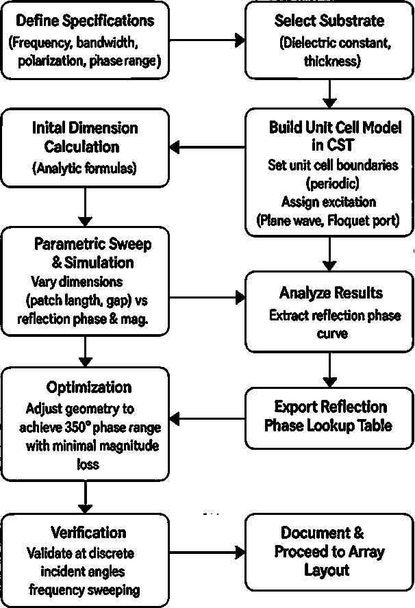
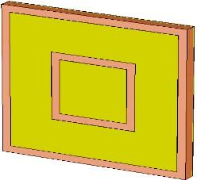
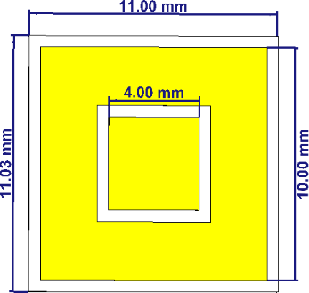
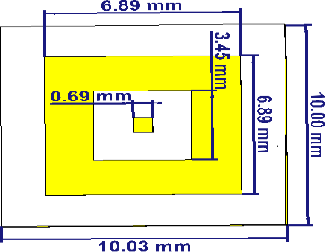
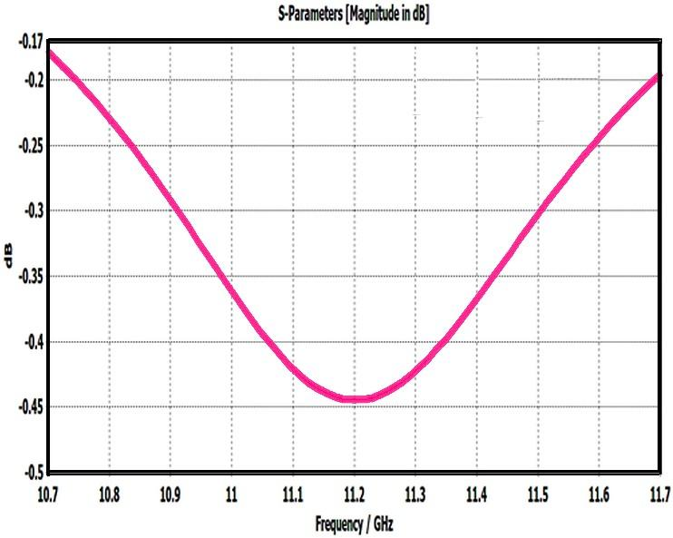
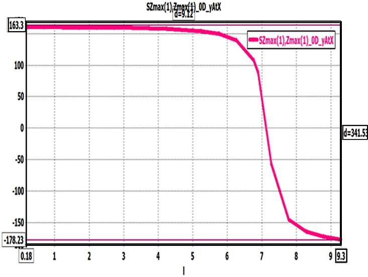
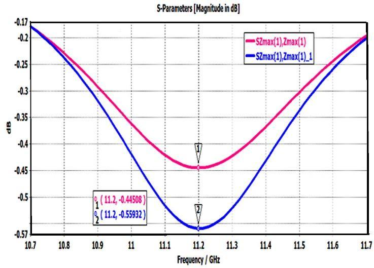
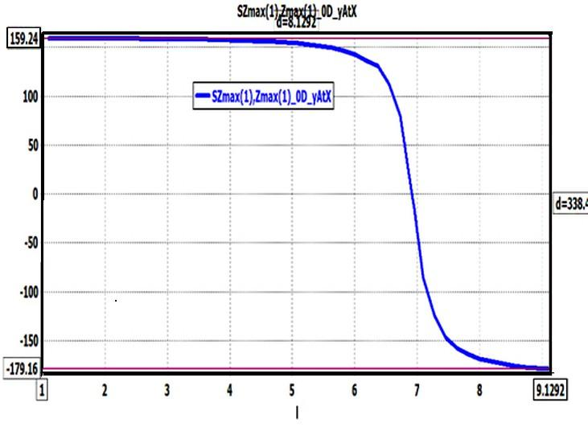
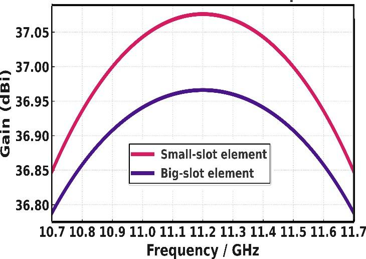

# Comparative Analysis of Inner Slot Loading in Square Patch Reflectarray Elements

**Authors:** Chris Calvin P, Afra Parveen Jameel, Dr. P. Jothilakshmi  
**Institution:** Amrita School of Engineering, Amrita Vishwa Vidyapeetham, Chennai, India  
**Published in:** 2025 IEEE International Conference on Electrical, Electronics, Communication and Computers (ELEXCOM)  
**DOI:** 10.1109/ELEXCOM67950.2025.11451361  

---

## Abstract

This work examines the influence of a concentric inner slot introduced into a conventional square microstrip patch element for high-frequency reflectarray applications. Two element configurations — small-slot and large-slot variants — are evaluated on a Rogers RT/duroid 5880 substrate under full-wave CST Microwave Studio simulation from 10.7 to 11.7 GHz using an infinite periodic boundary (Floquet port) model. The slot increases the usable reflection phase range from 310° to 342° while preserving the monotonic dispersion curve required for single-layer phase compensation. The proposed slot-loaded element is a practical alternative to plain square patches for compact Ku-band reflectarrays, adding no fabrication complexity since the slot is etched in the same lithographic step as the outer patch.

---

## 1. Motivation and Background

### 1.1 What is a Reflectarray?

A reflectarray antenna combines the low-profile planar form factor of microstrip technology with the high-gain beam-forming capability of a parabolic reflector. Instead of mechanically curving a surface, a reflectarray achieves the desired aperture phase profile by placing thousands of sub-wavelength resonant unit cells on a flat surface, each adjusted to re-radiate toward a specified direction. This eliminates the complex corporate feed networks of phased arrays while still enabling agile beamforming.

**Key reflectarray requirements:**
- **Phase range ≥ 360°** — a full 360° phase swing across the aperture is the ideal target; real designs aim for ≥ 310°
- **Reflection magnitude ≥ 0.9 (return loss ≤ −1 dB)** — ensuring near-unity efficiency across the aperture
- **Monotonic phase dispersion** — the phase vs. patch-size curve must be smooth and monotonic to enable reliable phase synthesis
- **Wide fractional bandwidth** — to minimize beam squinting with frequency

### 1.2 Problem with Conventional Square Patches

Conventional solid square patches are the simplest reflectarray element. They offer good efficiency but suffer from:
- **Constrained phase gradient near resonance** — the S-curve becomes very steep and narrow, complicating discrete phase quantization in large apertures
- **Narrow operational bandwidth** — typically below 8%, which limits scanning flexibility and wideband satellite service support
- **Limited phase range** — typically around 300–310°, leaving a gap that forces designers toward multilayer stacks or exotic geometries

### 1.3 Historical Context

Reflectarray development spans over three decades:
- **Late 1980s** — Simple square and circular patches; ~300° phase range, <8% bandwidth
- **Mid-1990s** — Variable-width patches and stub delay lines targeting 360° range
- **Early 2000s** — Concentric square rings, split-ring resonators, Jerusalem cross apertures introducing slot/ring loading
- **Post-2010** — Ku/Ka-band focus; fractal, nested resonator, dual-layer designs achieving >500° phase span and >25% fractional bandwidth; high-impedance metasurfaces for true time delay
- **Early 2020s** — Reconfigurable unit cells using PIN diodes, MEMS bridges, liquid crystal polymer, and graphene for real-time beam steering
- **2025 and beyond** — Machine learning-based optimization of broadband, dynamically reconfigurable apertures

This paper targets a specific practical niche: single-layer Ku-band reflectarrays where the slot loading technique offers meaningful phase range improvement without increasing fabrication complexity.

---

## 2. Design Methodology

### 2.1 Design Flow

  
*Fig. 1 — Design flow for the reflectarray unit cell. Begins with electrical specification (frequency, bandwidth, polarization, phase range) and substrate selection, proceeds through initial dimension calculation using analytic formulas (Hammerstad equations), full-wave Floquet port simulation in CST, parametric sweep of patch/slot dimensions, optimization for linear phase response and minimal magnitude loss, and verification at discrete incidence angles.*

The design process follows these stages:

1. **Electrical specification** — Target: 10.7–11.7 GHz (Ku-band), 1 GHz bandwidth, vertical polarization, phase range ≥ 310°
2. **Substrate selection** — Rogers RT/duroid 5880 (εr = 2.2, tan δ ≈ 0.0009, h = 0.254 mm)
3. **Initial dimension calculation** — Hammerstad equations for effective permittivity; cavity model for initial patch length and slot radius
4. **CST unit cell model** — Periodic boundary conditions (electric/magnetic walls on cell perimeter); Floquet port excitation at normal incidence simulating an infinite periodic array
5. **Parametric sweep** — Vary patch length, slot width, gap spacing; extract reflection coefficient Γ as complex magnitude and phase
6. **Optimization** — CST built-in optimizer targeting linear phase response, reflection magnitude >0.9, minimized dispersion across the band
7. **Verification** — Validate at discrete incidence angles; check mutual coupling does not distort the phase pattern; confirm reflection magnitude near unity across 10.7–11.7 GHz

### 2.2 Key Design Equation

The required element phase shift for aperture compensation at each cell location is:

```
φ_required = φ_target − 2βh
```

where β is the free-space wave number and h is the substrate thickness (βh represents the incident wave's free-space phase). By varying resonator or slot dimensions, the element reactance changes, shifting the reflection phase to match φ_required. A lookup table linking element dimensions to reflection phase is produced from the parametric sweep — this serves as the array's phase synthesis index.

---

## 3. Unit Cell Structures

### 3.1 Small Slot vs. Large Slot Configurations

  
*Fig. 2 — Slotted reflectarray square patch unit cells: (a) small slot — front, back, and perspective views showing a square patch with a shallow concentric square groove near the perimeter; (b) large slot — front, back, and perspective views showing a broad outer metallic ring surrounding a small central island with a wide square aperture.*

**Small slot (Fig. 2a):**
- A concentric square ring is removed near the patch perimeter, leaving a shallow groove (millimeter-scale width)
- The slot redirects surface currents, adjusting inductance and capacitance while preserving most of the conductive area
- The rear view shows a continuous, uninterrupted ground plane
- High quality factor (Q) is maintained due to minimal metal removal → low loss, slightly narrower phase range

**Large slot (Fig. 2b):**
- The slot width is greatly increased — the front view shows a broad outer metallic ring surrounding a small central island with a wide square aperture
- Removing more metal expands the effective current path length, lowering the resonant frequency
- Fields concentrate in the wider gap, raising local capacitance
- The back view still shows an intact ground plane with no vias — single-layer fabrication preserved
- Lower Q resonance → broader bandwidth and wider phase range, traded against a modest increase in conductor loss

### 3.2 Detailed Dimensions

**Small slot unit cell:**

  
*Fig. 3(a) — Small slot unit cell with annotated dimensions: patch lengths 11.0 mm (top) and 11.03 mm (side); concentric square slot opening of 4 mm per side. The narrowed channel between outer patch edge and inner slot edge lengthens the surface current path, slightly increases capacitance, and delivers a reflection phase near 130° at the design frequency.*

| Parameter | Value |
|-----------|-------|
| Outer patch length | 11.0 mm (top), 11.03 mm (side) |
| Inner slot aperture | 4.0 mm × 4.0 mm |
| Substrate pitch | ~11 mm |
| Metal removal | ~1/10 of total patch area |

**Large slot unit cell:**

  
*Fig. 3(b) — Large slot unit cell with annotated dimensions: substrate pitch 10 mm; main aperture 6 mm × 8 mm; secondary L-shaped cut 0.69 mm wide and 3.45 mm long; outer metallic ring 1–5 mm wide; central island < 1 mm. Greater metal removal enables ~360° phase swing at the cost of modest conductor loss increase.*

| Parameter | Value |
|-----------|-------|
| Substrate pitch | 10 mm × 10 mm |
| Main aperture | 6.89 mm × 6.89 mm (approx. 6×8 mm region) |
| Outer ring width | 1–5 mm |
| Secondary L-cut width | 0.69 mm |
| Secondary L-cut length | 3.45 mm |
| Central island | < 1 mm |

### 3.3 Floquet Port Excitation Model

  
*Fig. 4 — Floquet port excitation setup in CST showing a 3×3 periodic tile of the slotted unit cell. Electric and magnetic boundaries on the cell perimeter enforce infinite periodicity. The Floquet port launches a normally incident plane wave; the reflected field is decomposed into spatial harmonics. The zeroth-order term gives the co-polarized reflection coefficient expected from a large aperture under broadside illumination.*

The infinite periodic model is essential for accurate reflectarray unit cell characterization — it accounts for the mutual coupling between adjacent cells that a standalone patch simulation would miss. Each cell "sees" the electromagnetic environment of an infinite array, making the extracted S-parameters directly applicable to large aperture synthesis.

---

## 4. Simulation Results

All simulations were performed in CST Microwave Studio with Floquet port excitation, periodic boundary conditions (electric/magnetic walls), and adaptive mesh refinement at 10.7–11.7 GHz.

### 4.1 Return Loss — Large Slot Element

  
*Fig. 5 — Simulated S11 (reflection magnitude in dB) of the large-slot unit cell vs. frequency (10.7–11.7 GHz). The curve maintains near-0 dB throughout the 1 GHz band, with a minimum dip of approximately −0.45 dB near 11.2 GHz, remaining well within the −1 dB acceptable threshold.*

**Key observations:**
- Reflection magnitude at 10.7 GHz: ~−0.18 dB (98% power reflected)
- Minimum at 11.2 GHz: ~−0.45 dB (90% power reflected — >89% aperture efficiency even at worst point)
- Reflection magnitude at 11.7 GHz: ~−0.20 dB
- Broad, smooth V-shaped profile confirms that the enlarged slot and nested L-gap effectively lower the resonance
- Maximum current crowding (and hence highest loss) near 11.2 GHz — consistent with the resonance frequency
- Away from resonance, the outer metallic frame dominates, restoring high surface current density and minimizing dissipative loss

The unit cell comfortably satisfies the reflectarray requirement of reflection magnitude > 0.9 (S11 > −1 dB) across the entire 1 GHz operational bandwidth.

### 4.2 Return Loss Comparison — Small vs. Large Slot

  
*Fig. 6 — Overlaid S11 vs. frequency for both unit cells. Pink trace: small slot; blue trace: large slot. Both resonate at 11.2 GHz with smooth V-shaped profiles. The small slot reaches a minimum of ~−0.45 dB; the large slot reaches ~−0.56 dB — a difference of just over 0.1 dB.*

**Key observations:**
- Both elements resonate at the same design frequency (11.2 GHz) — outer patch dimensions dominate resonant frequency
- At band edges (10.7 GHz and 11.7 GHz): both show ~−0.2 dB loss — nearly identical far from resonance
- At resonance: small slot −0.45 dB vs. large slot −0.56 dB — just ~0.11 dB difference
- The large slot produces a slightly wider (lower-Q) dip → beneficial for phase agility across broader bandwidth
- The small slot maintains higher aperture efficiency for scenarios where loss is the primary constraint

**Design trade-off guidance:**
| Scenario | Recommended Element |
|----------|-------------------|
| Maximum aperture efficiency | Small slot |
| Wide phase swing for beam shaping | Large slot |
| Broadband bandwidth | Large slot |
| Low-loss beam-forming | Small slot |

### 4.3 Reflection Phase vs. Length — Small Slot

  
*Fig. 7 — Reflection phase vs. patch length for the small-slot unit cell. The S-shaped curve sweeps from +159° to −178°, covering a total phase range of ~338°. The steep linear transition occurs between 7 mm and 8 mm patch length, where resonance is induced. Phase range d = 338.6° annotated.*

**Phase curve analysis:**
- **0–6 mm:** Phase nearly constant at ~160° — element acts as a highly capacitive surface far from resonance; altering length has negligible effect on effective electrical length
- **6–6.5 mm:** Phase slope turns significantly negative — entering the resonant transition region
- **7–8 mm:** Steep phase decline through zero — inductance and capacitance balance at resonance; a small change in geometry causes a large phase shift (this is the high-resolution steering zone)
- **> 8 mm:** Phase stabilizes near −180° — element becomes inductive; second plateau of opposite phase
- **Total sweep:** ~320° (close to full 360°)

This classic S-shaped high-Q dispersion behavior is characteristic of resonant reflectarray elements: two broad plateaus flanking a steep central transition. The steep linear region enables fine phase resolution for precision beam synthesis; the flat plateaus offer stable, low-dispersion operating points.

### 4.4 Reflection Phase vs. Length — Large Slot, and Array Gain Comparison

  
*Fig. 8 (top) — Reflection phase vs. patch length for the large-slot unit cell, sweeping from +163° to −178° (total range ~342°, annotated as d = 341.5°). The shape mirrors the small-slot curve but with a slightly broader transition region. Fig. 9 (bottom) — Gain comparison of a 49×49 reflectarray using small-slot (solid) vs. large-slot (dashed) elements across 10.7–11.7 GHz. Small slot peaks at ~37.08 dBi; large slot peaks at ~36.97 dBi — a difference of ~0.1 dB.*

**Large slot phase curve analysis:**
- **0–6 mm:** Phase nearly constant at ~163° — capacitive surface regime
- **~6.5 mm:** Phase begins to decline — enlarged cavity drives patch toward resonance faster
- **7–8 mm:** Rapid phase decrease through zero, covering >160° within a narrow physical range — steeper transition, vital for high steering resolution
- **> 8 mm:** Stabilizes near −178°
- **Total sweep:** ~342° — 32° wider than small slot (310° baseline → 342°)

**49×49 Array Gain Comparison:**
- Small slot peak gain: ~37.08 dBi
- Large slot peak gain: ~36.97 dBi
- Difference: ~0.11 dBi — small but consistent with the per-element efficiency difference
- Both designs are well-centered around 11.2 GHz with ~0.25 dB roll-off toward band edges
- For maximum array gain, the small slot element is preferred; for broader phase synthesis latitude, the large slot is the choice

---

## 5. Performance Summary

| Parameter | Small Slot | Large Slot |
|-----------|-----------|-----------|
| Operating band | 10.7–11.7 GHz | 10.7–11.7 GHz |
| Design frequency | 11.2 GHz | 11.2 GHz |
| Min. return loss (at resonance) | ~−0.45 dB | ~−0.56 dB |
| Aperture efficiency (worst case) | >90% | >89% |
| Phase range (total sweep) | ~320° (310° baseline) | ~342° |
| Phase range improvement vs. plain patch | +10° | +32° |
| 49×49 array peak gain | ~37.08 dBi | ~36.97 dBi |
| Gain difference | Reference | −0.11 dBi |
| Fabrication complexity | Single layer, standard lithography | Single layer, standard lithography |
| Substrate | Rogers RT/duroid 5880 (εr = 2.2) | Rogers RT/duroid 5880 (εr = 2.2) |

---

## 6. Key Technical Contributions

1. **Phase range extension without added fabrication cost** — The slot is etched in the same lithographic step as the outer patch, requiring no additional masks, layers, or alignment tolerances. A conventional Ku-band reflectarray achieves ~310° phase range; this work demonstrates 342° with the large slot — a 32° improvement that gives designers meaningful additional latitude for aperture phase synthesis.

2. **Quantified efficiency trade-off** — The paper rigorously quantifies the gain-bandwidth trade-off: the large slot costs only ~0.11 dBi in array gain and ~0.11 dB in aperture efficiency at resonance, while returning 32° of additional phase swing and broader bandwidth. This numerical characterization allows designers to make informed element selection decisions for different aperture zones (e.g., small slot for low-sidelobe zone, large slot for wide-angle scan zone).

3. **Monotonic dispersion preservation** — A critical requirement for single-layer reflectarrays is that the phase vs. patch-size curve remain monotonic (S-shaped but smooth). Both slot variants maintain this property, confirming that slot loading does not introduce spurious resonances or inflection-point ambiguities that would complicate phase synthesis.

4. **Infinite array validation via Floquet port** — Using periodic boundary conditions with Floquet port excitation ensures the results account for mutual coupling in a realistic large-aperture environment, not just isolated element behavior.

5. **Applicability to satellite user terminals** — The 10.7–11.7 GHz band covers Ku-band satellite downlink allocations used in FSS (Fixed Satellite Service) and NGSO (Non-Geostationary Orbit) constellations (e.g., Starlink ground terminals). The slot-loaded element is a direct candidate for flat-panel reflectarray terminals requiring wide bandwidth and fine phase control within a strict weight and profile budget.

---

## 7. Applications

- **Ku-band satellite user terminals** — Flat-panel reflectarray antennas for VSAT, in-flight connectivity, and NGSO user terminals (10.7–12.75 GHz downlink band)
- **High-throughput satellite (HTS) systems** — Wide-bandwidth reflectarrays for frequency reuse in satellite spot beams
- **Compact radar front-ends** — Ku-band reflectarray apertures for weather radar, ground surveillance, and ISAR imaging
- **5G mmWave backhaul** — Reflectarray beam-steering for fixed wireless access links at Ku and Ka bands
- **NGSO constellation ground links** — User terminals requiring wide phase synthesis range for tracking non-geostationary satellites with changing elevation angles

---

## 8. Conclusion

Adding a concentric inner slot to a standard square microstrip patch produces a meaningful and practical improvement for Ku-band reflectarray applications. The large slot variant extends the phase range from 310° to 342° — a 32° gain — while maintaining reflection magnitude well above the −1 dB threshold throughout the 10.7–11.7 GHz band. The smooth monotonic phase dispersion is preserved in both variants, confirming suitability for single-layer aperture synthesis. The 49×49 array simulation confirms that the gain penalty is negligible (~0.11 dBi), making the slot-loaded element a practically superior choice for reflectarrays that need broader phase control without the cost, weight, or alignment complexity of multilayer structures or exotic materials.

---

## Image Index

| File | Description |
|------|-------------|
| `images/fig1_design_flow.png` | Design flow: specifications → substrate → dimensions → CST Floquet simulation → sweep → optimization → verification |
| `images/fig2_unit_cell_structure.png` | Front, back, and perspective views of (a) small slot and (b) large slot unit cells |
| `images/fig3a_small_slot_dimensions.png` | Small slot unit cell with annotated dimensions (11 mm patch, 4 mm inner aperture) |
| `images/fig3b_big_slot_dimensions.png` | Large slot unit cell with annotated dimensions (6.89 mm aperture, L-cut, central island) |
| `images/fig4_floquet_port_excitation.png` | 3×3 periodic tile showing Floquet port excitation and infinite array boundary setup in CST |
| `images/fig5_return_loss_big_slot.png` | S11 vs. frequency for large slot unit cell — min. −0.45 dB at 11.2 GHz, <−1 dB across full band |
| `images/fig6_return_loss_comparison.png` | Overlaid S11 comparison: small slot (pink) vs. large slot (blue), both at 11.2 GHz |
| `images/fig7_small_slot_phase_vs_length.png` | Reflection phase vs. patch length for small slot — S-curve sweeping ~338° (d = 338.6°) |
| `images/fig8_big_slot_phase_and_gain.png` | Phase vs. length for large slot (~342°) and 49×49 array gain comparison (small vs. large slot, peak ~37 dBi) |

---

*Chris Calvin P — ch.en.u4ece23011@ch.students.amrita.edu*  
*Amrita Vishwa Vidyapeetham, Chennai | B.Tech ECE 2023–2027*
